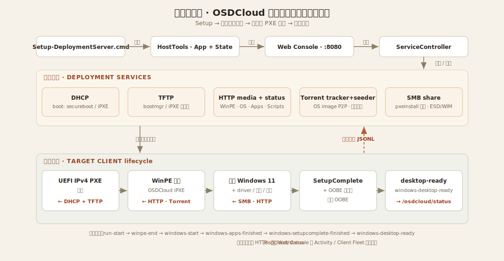
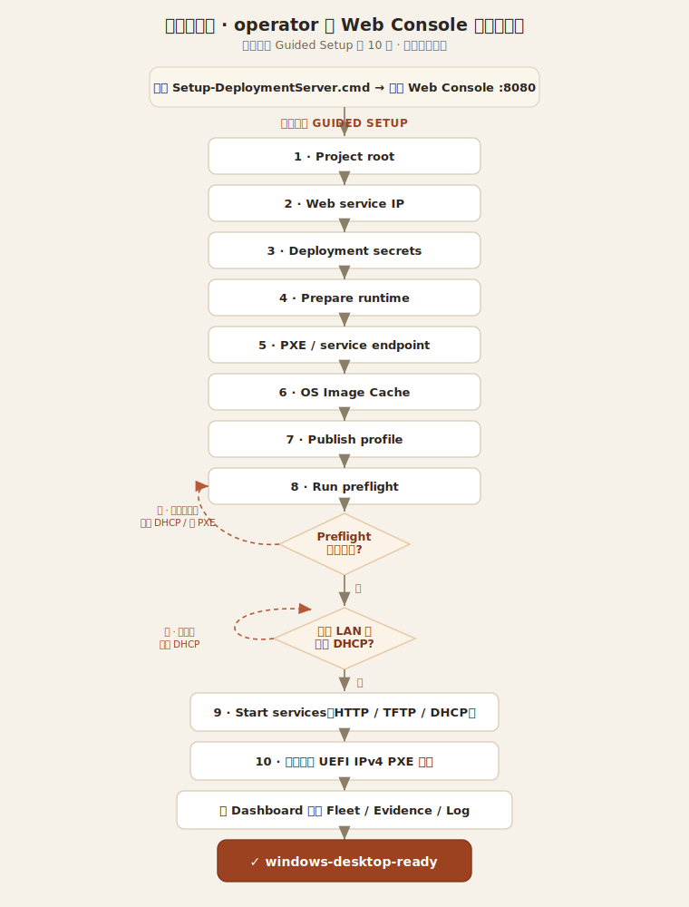

# OSDCloud Windows 11 Zero-Touch Deployment Lab

這個資料夾記錄 OSDCloud + iPXE 自動部署 Windows 11 的工具與設定。Active path 是實體筆電從有線內網 PXE 開機；VM regression 只用來快速驗證 WinPE/OOBE/status callback 流程。

## 第一次部署最短路徑

另一台 Windows host 接手時，只需要 GitHub repo URL。不要搬 `deployment-server-bundle`，不要跑 `git lfs pull`，也不要先手動複製大型 MSI/ESD/WIM/ISO 檔。

1. 從系統管理員 PowerShell clone 並執行 setup：

   ```powershell
   git clone <repo-url> <repo-root>
   cd '<repo-root>'
   .\Setup-DeploymentServer.cmd
   ```

2. 若 repo 已存在，先更新再執行 setup：

   ```powershell
   git pull
   .\Setup-DeploymentServer.cmd
   ```

3. setup 會安裝 host management bundle 到：

   ```text
   C:\OSDCloud\HostTools\App
   C:\OSDCloud\HostTools\State
   ```

4. setup 完成後開 Web console：

   ```text
   http://127.0.0.1:8080
   ```

5. 第一次進入 Web console 時，使用 `引導設定 (Guided Setup)`。它會依序顯示每一步的用途、完成條件與安全提醒。

6. 在 Guided Setup 依序完成：

   ```text
   Project root -> Deployment secrets -> Prepare runtime -> Select endpoint
   -> OS Image Cache -> Publish profile -> Run preflight
   ```

7. `Run preflight` 必須全部通過。只要有 blocking failure，不要啟動 DHCP，也不要讓 client PXE 開機。

8. 確認網路模式：
   - **隔離網路（無其他 DHCP）**：保持預設 `DHCP Server` 模式，winception 自行分配 IP。
   - **共用內網（已有路由器 DHCP）**：在 `Endpoint Settings → DHCP Mode` 切換為 `PXE Proxy (relay)` 模式，winception 只注入 PXE 開機選項，不分配 IP，避免雙 DHCP 衝突。
   
   確認模式選擇正確後，在 Guided Setup 或 Dashboard 按 `Start services` / `Start all services`。

9. 目標電腦從 `UEFI IPv4 PXE` 開機，不使用 USB/ISO，不手動點 OOBE。

10. 回 Web Dashboard 看 `Client Fleet`、`Validation Evidence`、`System Log`，最後狀態應到 `windows-desktop-ready`。

若後續只需要操作部署主機、不需要在該主機上修改 repo source，setup 成功後可刪除原始 clone，改用 `C:\OSDCloud\HostTools\Open-WebConsole.cmd` 重新開啟 Web console。

分工固定如下：

| 階段 | 做什麼 | 不做什麼 |
| --- | --- | --- |
| `Setup-DeploymentServer.cmd` | 檢查 Git、必要時自動安裝 Node.js LTS/npm、準備 NuGet/PSGallery、安裝 `OSD` / `OSDCloud` PowerShell modules、安裝 host management bundle 到 `C:\OSDCloud\HostTools`、執行 `npm install`、`npm run smoke`，最後啟動 `npm run web` | 不建立 live deployment runtime root、不要求 deployment secrets、不建立 SMB、不跑 endpoint sync/preflight、不啟 HTTP/TFTP/DHCP |
| `Prepare runtime` | 在 Web 選定的 project root 建立 runtime 結構、準備 `pxeinstall` / `OSDCloudiPXE`、下載或重建 iPXE/wimboot/boot binaries、WinPE `boot.wim` | 不自動啟動 deployment services，不替 operator 選 OS image，也不預先下載 client software |
| OS Image Cache / profile publish | 下載或匯入 ISO/ESD/WIM、讀取 DISM indexes、匯出選定 index 成單一 WIM、發佈 `selected-os.json` | 不在 fresh clone 預設固定 Windows 版本 |
| Endpoint sync / preflight | 把本次 NIC/IP 寫入 live `boot.ipxe`、WinPE `boot.wim`、SMB firewall 與 local overlay，並檢查 runtime / OS WIM 可部署 | 不替你確認外部 LAN DHCP 已關閉 |
| Start services | operator 明確確認後才啟 HTTP/TFTP/DHCP responders | 不自動開始部署 |

若 first-run Initialization Wizard 已開啟，直接從 wizard 執行 `Prepare runtime` 即可；確認後 wizard 會留在畫面上顯示 running/completed/failed 狀態與可捲動的完整 operation log，標題列的 copy 按鈕可複製本次 operation 全部 log。從主畫面 Runtime Readiness 卡片執行時，則用主畫面的 operation badge 與 System Log 監看。

## 部署流程圖

GitHub 直接渲染下列 SVG 圖。完整節點說明與安全閘門見
[docs/diagrams/technical-flow.md](docs/diagrams/technical-flow.md) 與
[docs/diagrams/user-flow.md](docs/diagrams/user-flow.md)。

### 技術流程圖：系統架構與資料流



### 用戶流程圖：operator 操作路徑



## 目前狀態

已驗證成功的目標：

- 從 OSDCloud ISO 自動部署 Windows 11
- 使用 ISO 內建 Windows 11 ESD 快取，不重複從外網下載 OS
- 從 iPXE 網路開機下載 WinPE，WinPE 再從 host SMB share 直接套用 Windows 11 ESD
- 第一次從硬碟開機後自動略過 OOBE
- 建立自訂的本機管理員帳號與密碼
- 自動登入桌面
- Profile 可獨立設定 display language、regional format 與 Windows time zone；輸入法沿用所選 OS 映像預設
- tracked `All in One` profile 使用 en-US WIM、`en-US` UI/format 與 `Taipei Standard Time`
- 停用 OOBE 更新檢查

## Torrent P2P 映像分發（預設啟用）

數十台 client 同時部署時，過去每台都直接從 host SMB 串流套用 OS WIM，host 磁碟/網卡是單點瓶頸。現在預設啟用 BitTorrent P2P：每台 client 邊下載 WIM 邊把 piece 分享給其他 peer，傳檔壓力分散到整個 fleet。

- **技術**：WinPE 端用單一靜態執行檔 `aria2c.exe`（開源，邊下載邊做種）當 BT leecher/seeder；host 端在既有 Node console 內跑兩個服務：`TorrentTracker`（HTTP tracker，`bittorrent-tracker` MIT）當 announce server，以及 `NodeSuperSeeder`（Node.js 原生 BT wire protocol 實作）當 swarm 來源種子。Host seeder 不再依賴 `aria2c.exe`，直接以 Node.js TCP server 對 VM 提供 piece。
- **不使用 HTTP webseed**：`.torrent` 刻意不嵌 BEP19 webseed —— aria2 會把 webseed 當主來源，導致每台 client 都從 host 整檔拉、完全不分擔。改走純 BitTorrent（tracker + peers + host 種子）。
- **wave / batch**：第一個新 peer handshake 後固定收集 24 秒，不因後續加入重置。第一批依實際人數以 `piece i → slot i mod n` 分配互斥條帶；晚到 batch 在前批 peer 仍活躍時使用 `peer-only`，優先從前批取得資料。同一 aria2 的 TCP reconnect 以 `infoHash + peerId` 沿用原 assignment。
- **host budget 與 fallback**：每個 wave 正常 host 上傳上限為 `1.15x WIM`；30 秒沒有 non-host heartbeat 才結束 wave。若 active client 的 `completedLength` 連續 3 分鐘不增加，會明確進入 emergency host fallback，允許突破 budget 以完成部署；Web、transition event 與 seeder log 都會顯示原因及超額 bytes。
- **Web 即時監控**：Torrent Tracker card 每 2.5 秒刷新 wave/batch、24 秒倒數、host ratio、active/stale/fallback 數量與 piece coverage，並逐台顯示 phase、batch/slot/mode、進度、上下傳速率、ETA、來源、receivers 與 last seen。15 秒無 telemetry 標示 stale，60 秒後移出 active rows；5 秒 telemetry 不寫入 deployment status JSONL。
- **client 即時畫面與 seed wait**：WinPE 透過 loopback-only、隨機 token 的 aria2 JSON-RPC 每 5 秒顯示下載狀態與 peers，並回報安全欄位 telemetry。WIM 通過 SHA-256 後，aria2 會在套用 Windows 期間繼續 seeding；套用完成、`osdcloud-finished` 與 reboot 前等待至「torrent 完成時間 + `seedMinutes`」（預設 30 分鐘，套用時間已包含）。Client 可按 Enter，管理員也可在 Web 對單台按 `Continue to reboot` 或以確認式 `Continue all waiting` 提前結束。RPC shutdown 失敗才強制停止 aria2。
- **持久化與 log**：release request、wave budget 與 peer assignment 原子寫入 `C:\OSDCloud\HostTools\State\torrent\coordinator.json`；Web restart 後由檔案與 client heartbeat 恢復。`torrent-seeder.log` 記錄 wave/batch/slot、host bytes 與 emergency fallback；`torrent-tracker.log` 保留 announce 診斷。
- **WIM 落地**：WinPE 先用 `New-OSDisk` 分割目標磁碟，把 WIM 下載到本機 OS 分割區並驗證 SHA-256，再以本機檔案套用（`SkipAllDiskSteps`，不重複分割）。任一環節失敗（缺 `aria2c.exe`、torrent metadata 不全、下載/雜湊失敗、或無 peer/種子可連）會自動回退到既有的 SMB 直接套用路徑。
- **runtime 需求**：`aria2c.exe` 與 `Report-TorrentTelemetry.ps1` 由 endpoint sync 注入 `boot.wim`。`.torrent` 與 sidecar `os-torrent.json` 在 profile publish / endpoint sync 時重新產生，種子隨之重啟。
- **設定**：`config\osdcloud-console.json` 的 `torrent` 區塊可調整。停用時設 `"torrent": { "enabled": false }`，client 會直接走 SMB 路徑。

```json
"torrent": {
  "enabled": true,
  "trackerPort": 6969,
  "seederListenPort": 6881,
  "pieceLengthBytes": 4194304,
  "seedMinutes": 30
}
```

> 注意：P2P 落地路徑會在套用前重新分割目標磁碟，屬於部署關鍵路徑變更。請先以 VM regression 路徑驗證再用於大量實體部署；SMB 直接套用回退完整保留。

## 本機 Deployment Secrets

Repo 不提交真實密碼。新 host 預設做法是在 Web 第一次進入時，由初始化精靈的 `Deployment Secrets` 步驟輸入自訂的 Windows 本機管理員帳號 `windowsUsername` 與 `windowsPassword`；Web 後端會自動產生僅含英數字的 24 碼隨機密碼作為 `pxeinstallPassword`，並寫入 `C:\OSDCloud\HostTools\State\config\osdcloud-secrets.json`，API 回應與 log 都不回傳密碼明文。

若需要離線或手動建立，也可以先在 lab host 建立本機檔案：

```powershell
Copy-Item 'C:\OSDCloud\HostTools\App\config\osdcloud-secrets.example.json' 'C:\OSDCloud\HostTools\State\config\osdcloud-secrets.json'
notepad 'C:\OSDCloud\HostTools\State\config\osdcloud-secrets.json'
```

`C:\OSDCloud\HostTools\State\config\osdcloud-secrets.json` 必須包含：

```json
{
  "windowsUsername": "<local-account-username>",
  "windowsPassword": "<local-account-password>",
  "pxeinstallPassword": "<smb-account-password>"
}
```

可改用 PowerShell session 環境變數 `OSDCLOUD_WINDOWS_USERNAME`、`OSDCLOUD_WINDOWS_PASSWORD` 與 `OSDCLOUD_PXEINSTALL_PASSWORD`，但不要把真實值寫進文件、報告、commit message 或測試輸出。Web initialization / endpoint sync 會檢查本機 secret 狀態；執行 endpoint sync 時，工具會把本機 secret 注入 live `boot.wim`，讓 WinPE 可以掛載 SMB 並把 SetupComplete 需要的本地帳號密碼交給已部署的 Windows。

測試期間若本機 ignored secrets 已存在、環境變數已設定，或 operator 已經提供可用值，agent 可以直接透過 Web/API 初始化流程設定或更新 deployment secrets，不需要再次要求人工確認。若缺少可用值或需要輪替密碼，才停止請 operator 介入；任何文件、log、commit、status 或回報都不能包含明文 secret。

## 流程分界

本 workspace 的 PXE、USB/ISO 與歷史 ISO 路徑彼此獨立，不能混用證據：

| 路徑 | 用途 | Host endpoint | 入口 | 驗證意義 |
| --- | --- | --- | --- | --- |
| 實體筆電 iPXE | Active path，用來驗證真實大量部署 | Web console 選定的 service interface / service IP | `npm run web` | 可作為實體部署證據 |
| VM iPXE | Regression path，用來快速驗證 WinPE、OOBE、status callback | VM 用的 internal switch | `node .\tools\osdcloud-console\src\headless.js` | 只證明 VM regression，不代表實體筆電路徑已準備好 |
| USB/ISO offline installer | Add-on path，使用目前 active deployment snapshot 離線安裝 | 不使用 host endpoint | `New-WinceptionUsbInstaller.cmd` | 只證明該 immutable media snapshot |
| ISO VM | Retired historical path，過去用來驗證 ISO zero-touch | retired `C:\OSDCloud\Win11-Lab\OSDCloud_NoPrompt.iso` | VM DVD/ISO boot | 只保留為歷史證據，不屬於 fresh-host runtime |

切換 PXE endpoint 路徑時必須同步 live `C:\OSDCloud`、published `boot.wim`、`config\osdcloud-console.json` 與 `osdcloud-assets`。USB/ISO export 不執行這個 sync，也不改變 live endpoint。不要把 VM 的 endpoint 當成實體筆電設定，也不要把某一次實體筆電測試使用的 service IP 當成永久設定。

### USB/ISO zero-touch installer

在 elevated PowerShell 從 workspace 或 installed `C:\OSDCloud\HostTools\App` 執行：

```powershell
.\New-WinceptionUsbInstaller.cmd -Usb -DiskNumber 3 -CheckOnly
.\New-WinceptionUsbInstaller.cmd -Usb -DiskNumber 3
.\New-WinceptionUsbInstaller.cmd -Iso
.\New-WinceptionUsbInstaller.cmd -Iso -OutputPath D:\Winception-USB.iso
.\New-WinceptionUsbInstaller.cmd -Iso -OpenInRufus -RufusPath C:\Tools\rufus.exe
```

command 先驗證 merged live config、OSD/OSDCloud modules、boot files、active profile、selected WIM hash、selected Apps/Scripts、driver pack cache、三個 deployment secrets、容量與 FAT32 限制。建立流程只讀 live runtime，在 HostTools State 的 `.staging` 產生 immutable snapshot；不修改 `Media\sources\boot.wim`、PXE endpoint、services 或 live boot media。USB 只接受非 boot/system 的 USB disk，顯示 model/serial/size 後要求精確輸入 `ERASE DISK <number>`；輸出為 GPT、UEFI x64、FAT32 `WinPE` + NTFS `OSDCloudUSB`。ISO 預設寫到 `<project-root>\Exports`；`-OpenInRufus` 只預載 ISO 與 NTFS preference，operator 仍須在 Rufus UI 選 disk 並開始寫入。

USB/ISO 內含可擷取的 Windows 與 PXE deployment credentials，必須視為敏感資產。離線 WinPE 只允許一個符合條件的 internal target disk；同一 media ID 完整套用後會以 `appliedAt` marker 拒絕再次清除。Windows 階段把最後進度原子寫入 `DeploymentStatus.json.localStatus`，不呼叫 host telemetry。Zero-touch 從 operator 的 one-time UEFI USB/ISO boot selection 後開始。

實體筆電 endpoint 每次以 Web console 選定的 service interface / service IP 為準。下一次實體筆電測試前，先確認 `config\osdcloud-console.json`、live `boot.ipxe`、published `boot.wim` 內嵌 endpoint 與 host 網卡狀態一致。

## 目前主機網路拓樸

目前主機用兩張實體 NIC 分工：

| 介面 | 角色 | Host IP | Gateway | 備註 |
| --- | --- | --- | --- | --- |
| `WAN` | Host 預設上網 | （依環境設定）| （依環境設定）| Default route 只走這張，metric `5` |
| `LAN` | 實體 client / PXE lab | `192.168.88.1/24` | 無 | Metric `500`，IP forwarding enabled |

`LAN` 目前規劃為獨立 client subnet。Windows NAT 已建立：

```text
Name   : OSDCloud-PhysicalClient-NAT
Prefix : 192.168.88.0/24
```

接在 `LAN` 後面的 client 若手動設定，可使用：

```text
IP      : 192.168.88.x
Mask    : 255.255.255.0
Gateway : 192.168.88.1
DNS     : 1.1.1.1 / 8.8.8.8
```

若下一次實體筆電 PXE 部署要走這張 `LAN`，必須先在 Web console 選取 `LAN`，或用同步工具把 live iPXE endpoint 改到 `LAN` / `192.168.88.1`，並同步 `boot.wim` / `osdcloud-assets`。單純改 Windows NIC IP 或名稱不會自動修改 WinPE 內嵌 endpoint。

## 新主機 Clone 後啟動流程

這一段是給另一台 Windows host 從 GitHub repo URL 接手部署用的正式 runbook。Repo 可以 clone 到任意資料夾；實際 PXE/OSDCloud runtime 使用 Web initialization 選定的 deployment project root，預設仍可用 `C:\OSDCloud`。Git clone 只作為安裝資料來源與可審查設定來源；setup 會把 host management bundle 安裝到 `C:\OSDCloud\HostTools\App`、把 mutable host state 建到 `C:\OSDCloud\HostTools\State`，之後部署主機可只靠 `C:\OSDCloud` 繼續運作。大型 runtime artifact 不放 Git、不要求 Git LFS、不要求 `deployment-server-bundle`。

正式入口固定是零互動主程式 setup：

```powershell
git clone <repo-url> <repo-root>
cd '<repo-root>'
.\Setup-DeploymentServer.cmd
```

舊的 `Deploy-DeploymentServer.cmd` 仍可執行，但現在只是相容 wrapper，會導向 `Setup-DeploymentServer.cmd`。`tools\Initialize-DeploymentServer.ps1` 保留為 legacy/full-bootstrap 或 Web runtime preparation 的底層 helper，不再是新 host 預設入口。

### 1. 安裝主機前置條件

新 host 需要：

- Windows 11，使用系統管理員 PowerShell 操作。
- Git；不需要 `git lfs pull`。
- Node.js / npm，可執行 ESM 與 `node --test`。若缺少，setup 會透過 `winget` 自動安裝 Node.js LTS；npm 會隨 Node.js 一起安裝。
- PowerShell Gallery / NuGet provider，以及 `OSD`、`OSDCloud` PowerShell modules；setup 會自動準備並以 `AllUsers` scope 安裝。
- Windows ADK、Windows PE Add-on 後續由 Web `Prepare runtime` 檢查或自動安裝；setup 階段不下載或重建 WinPE。
- 一張可上網的 host NIC，以及一張服務 PXE client 的隔離 LAN NIC；目前範例為 `WAN` 上網、`LAN` = `192.168.88.1/24`。
- 本機 deployment secrets 預設由 Web 初始化精靈寫到 `C:\OSDCloud\HostTools\State\config\osdcloud-secrets.json`；setup 不會要求或寫入 deployment secrets。

### 2. 執行輕量 setup

`Setup-DeploymentServer.cmd` 直接執行 `tools\Setup-DeploymentServer.ps1`，全新主機應從系統管理員 PowerShell 執行。setup 不詢問 console prompt；它只做主程式可啟動所需檢查與安裝：

- 檢查 repo root、Git、Node/npm；若缺少 Node/npm，直接以 `winget` 安裝 Node.js LTS。
- 啟用 TLS 1.2、確保 NuGet package provider 可用、信任 PSGallery，並安裝 `OSD` / `OSDCloud` PowerShell modules。
- 將 host management bundle 安裝到 `C:\OSDCloud\HostTools\App`，並把可變 host state seed 到 `C:\OSDCloud\HostTools\State`。
- 在 installed `AppRoot` 執行 `npm install` 與輕量 `npm run smoke`，確認 Web 主程式可啟動。
- 預設 Web management 只綁定 `127.0.0.1:8080`；若要改綁本機其他 IPv4，可用 `Setup-DeploymentServer.cmd -WebHost <ip>`。
- 將 `web.host` 與固定 `web.port=8080` 寫入 `C:\OSDCloud\HostTools\State\config\osdcloud-console.local.json`。
- 啟動 Web console：在新的 elevated PowerShell 視窗以 installed bundle 執行 `npm run web`，因為後續 `Prepare runtime` 與 service control 需要管理員權限。

setup 只會下載/安裝主程式 host prerequisites，例如 Node.js LTS 與 `OSD` / `OSDCloud` PowerShell modules；不會下載或重建 ADK、WinPE、ESD/WIM、MSI/EXE payload、iPXE 或 `wimboot` artifact；不會建立 live `Media` / `PXE-HttpRoot` / `PXE-TFTP` runtime skeleton、不會建立 SMB share 或本機 `pxeinstall` 帳號、不會要求 deployment secrets、不會呼叫 runtime restore、endpoint sync、server preflight；也不會啟動 HTTP/TFTP/DHCP deployment services。

成功後若不再需要該主機上的 repo source，可刪除原始 clone；後續入口改用 `C:\OSDCloud\HostTools\Open-WebConsole.cmd` 或 `C:\OSDCloud\HostTools\App\tools\Start-InstalledWebConsole.ps1`。

如果 setup 呼叫 `winget install OpenJS.NodeJS.LTS` 時顯示 Node.js 已安裝且沒有可更新版本，通常是目前 PowerShell session 還沒刷新 PATH。新版 setup 會重新讀取 machine/user PATH 並探測標準 `C:\Program Files\nodejs` 位置後續跑；如果仍失敗，關閉 PowerShell、重新開系統管理員 PowerShell，再執行 `node --version`、`npm --version` 與 `.\Setup-DeploymentServer.cmd`。

若要離線或手動控管 prerequisite，可用 `-NoNodeAutoInstall` 或 `-NoPowerShellModuleAutoInstall` 讓 setup 在缺少對應項目時明確失敗。若要測試 setup 行為，可用；`-DryRun` 仍會保存唯一允許的 Web local overlay，但不執行 npm install/smoke、launch、secrets、runtime、SMB、PXE 或服務動作：

```powershell
.\tools\Setup-DeploymentServer.ps1 -DryRun -NoLaunch -SkipNpmInstall -SkipSmoke
.\tools\Setup-DeploymentServer.ps1 -WebHost 127.0.0.1 -NoLaunch -SkipNpmInstall -SkipSmoke
```

### 3. Web 初始化精靈

setup 完成後開啟：

```text
http://<setup-selected-web-ip>:8080
```

Web console 每次載入 `/api/state` 都會從 live state 重新計算 `initialization.initialized`，不使用單一 marker。若尚未完成，會自動開啟 initialization wizard，但 dashboard 仍可讀。精靈依序引導：

1. 確認 deployment project root / working directory；預設可用 `C:\OSDCloud`，但可改成其他絕對路徑，且不能位於 Git clone 內。
2. 儲存 deployment secrets 到 `C:\OSDCloud\HostTools\State\config\osdcloud-secrets.json`。
3. `Prepare runtime`，在選定 root 建立 runtime、準備 SMB account/share、boot artifacts 與 WinPE；不啟動 HTTP/TFTP/DHCP，也不下載 client software。
4. 選 PXE/service endpoint 並在 Web 內 sync endpoint。
5. 到 `OS Image Cache` 下載或匯入 ISO/ESD/WIM、選 DISM index、匯出單一 WIM。
6. Publish active profile，寫出 `selected-profile.json` 與 `selected-os.json`。
7. `Run preflight`，通過後再手動 `Start all services`。

`Deployment secrets` 的 password 欄位只會在 Required Steps 的同一列缺失時顯示，儲存後該列變成 `Done` 並只保留已設定摘要；Web 不回填、不顯示 plaintext secret，也不在完成狀態顯示重新輸入欄位。

Runtime Readiness 面板仍會顯示 `C:\OSDCloud` 是否缺少必要 boot/iPXE/WinPE artifact。缺檔時 Web 仍可啟動，operator 要明確點 `Prepare runtime` 才會建立 runtime 目錄、準備 `pxeinstall` / `OSDCloudiPXE`、下載或重建大型 boot artifact。這一步沿用 `config\runtime-artifacts.json`；穩定下載項目先進 `.downloads` staging，size 與 SHA-256 驗證成功後才移入 live path。正常新 host setup 會先安裝 `OSD` 與 `OSDCloud` PowerShell modules，因為後續 endpoint sync 需要把兩個 module 注入 `boot.wim`；若離線或使用 `-NoPowerShellModuleAutoInstall` 導致缺少 module，請補齊後再重跑 setup / `Prepare runtime` / endpoint sync。Client software installer 不屬於 Runtime Readiness；等 profile publish / Set active 時，Web 才依 active profile 的 `selectedSoftware` 從 `config\software-catalog.json` 補齊被選中的 payload。由 ADK/OSDCloud 生成、且會被 endpoint sync 注入本機 endpoint/secrets 的 `boot.wim` 只用必要路徑存在性判定 readiness，不在 runtime catalog 固定 size/hash。

從 Initialization Wizard 按 `Prepare runtime` 時，確認後 wizard 會保持開啟並顯示 `Preparing runtime artifacts` 的 running/completed/failed 狀態、錯誤訊息與可捲動的完整 operation log；標題列 copy 按鈕會複製本次 operation 全部 log。若 Web console 不是從 elevated PowerShell 啟動，Wizard 與 Runtime Readiness 卡片都會先顯示必須重新以 elevated Web console 執行，而不是等到 `Restore-DeploymentArtifacts.ps1` 半路失敗才回傳 PowerShell stack。Web 會隱藏 ADK/WinPE installer 可能輸出的無害 `System.Security.AccessControl.ObjectSecurity` duplicate TypeData 訊息；下載使用 `curl.exe` 時會隱藏正常進度條但保留錯誤輸出。ADK installer 若無法透過 `Get-AuthenticodeSignature` 完成驗證，會改用 WinVerifyTrust fallback；fallback 通過、DaRT optional 檔案不存在、或 WinPE PowerShell Gallery optional module injection 被略過，都不等於 `Prepare runtime` 失敗。`/api/runtime/prepare` 會在 restore 子程序結束後重新檢查 Runtime Readiness；如果仍有 artifact blocked，operation 必須顯示 failed 並列出未完成項目，不可只因子程序 exit code 成功就標示 completed。這只是 UI 進度呈現；實際仍沿用同一個 `/api/runtime/prepare` 長任務，不新增取消功能，也不啟動 HTTP/TFTP/DHCP。若從主畫面 Runtime Readiness 卡片按 `Prepare runtime`，仍維持主畫面流程並可從 operation badge / System Log 監看。

Initialization Wizard 的 `Prepare runtime` 步驟會在按下執行前展開缺失 artifact 摘要，列出名稱、類型、來源/處理方式、原因與第一個目標路徑；多個 target 缺失時會顯示 target 數量。這只是執行前資訊揭露，不代表已啟動 HTTP/TFTP/DHCP，也不能逐項勾選或跳過。

Runtime catalog 支援 optional dependency graph 欄位：`dependsOn` 表示 artifact 依賴的其他 artifact id，`prepareGroup` 表示 `Prepare runtime` 實際會處理的修復群組，`prepareReason` 是給 operator 的簡短原因。Readiness 會驗證 dependency id、拒絕循環依賴，並在 Wizard 明細中顯示 `blocked by ...` 與對應 prepare group。這個 graph 只改善檢查與說明；`Prepare runtime` 的執行模型仍維持現有順序。

目前 WinPE boot artifact 以 `winpe-workspace` 群組表示：`winpe-boot-wim` 是 OSDCloud workspace build 產出的核心 `boot.wim`，`windows-bootmgr`、`windows-bootx64-efi`、`windows-bcd`、`windows-boot-sdi` 都依賴它，並從同一個 generated OSDCloud workspace media 發布。必要的 `boot.wim` source / published 路徑缺失時，`Prepare runtime` 仍會重建 workspace 並發布整批 boot files；穩定的 generated/downloaded boot binaries 仍以 catalog size/hash 驗證。

Active runtime 只需要：

```text
C:\OSDCloud
```

`C:\OSDCloud\Win11-Lab` / ISO path 已正式退役，只作為歷史證據描述；新 host 不需要 restore 或 rebuild 這個資料夾。

`Prepare runtime` 會檢查 `boot.wim` 兩個必要路徑都存在。iPXE 的 `boot.ipxe` 會透過 HTTP 載入 `wimboot`、Windows boot binaries 和 published `boot.wim`；`boot.wim` 裡面是 WinPE，以及 OSDCloud 啟動、SMB mapping、status callback、SetupComplete handoff、local secret injection 後的部署邏輯。沒有完整 `boot.wim`，client 連 WinPE 都進不去，後續 OS image 套用不會開始。因為 `boot.wim` 會受 ADK/OSDCloud build、endpoint sync、local secret injection 影響，runtime catalog 不固定它的 size/hash；需要 hash evidence 時由 `osdcloud-assets\manifest.json` 記錄當次同步快照。

Prepare runtime 會使用 installed base `C:\OSDCloud\HostTools\State\config\osdcloud-console.json` 加上 ignored `C:\OSDCloud\HostTools\State\config\osdcloud-console.local.json` overlay。local overlay 只保存本機 endpoint/secrets 周邊狀態，不是完整 config；下游工具不應把 `.local.json` 當成完整設定檔。

OS image 不屬於 `Prepare runtime` 的固定預設。fresh clone 可以沒有 `activeImage`、沒有 profile OS image、也沒有 `selected-os.json`；Web 應顯示「尚未選擇 OS image」。operator 需到 `OS Image Cache` 下載或匯入任意語言的 Windows 11 Pro Retail ISO/ESD/WIM，選擇 DISM image index，讓 Web 匯出成 `<project-root>\Media\OSDCloud\OS\<selected-image>.wim` 的單一 WIM，再透過 publish 寫出 `selected-os.json`。官方 catalog filter 可輸入非預設語言 tag 與未來 release tag；25H1/25H2 之外的 26H1/26H2 或後續版本只要上游 OSD catalog 提供就可載入。部署時使用匯出的 WIM index `1`，原始來源檔名與原始 index 保留在 metadata 供查核。

### 4. 設定本次 PXE service endpoint

setup 選擇的 NIC/IP 會寫入 ignored `config\osdcloud-console.local.json`，Web 啟動時會把它 overlay 到 committed `config\osdcloud-console.json` 上。這避免新 host 的 local endpoint 直接弄髒 repo default / lab snapshot。

如果 Windows NIC 尚未設定服務 IP，setup 不會替你改。先用系統管理員 PowerShell 確認要服務 PXE client 的實體 NIC，必要時手動設定 IP，或使用明確的 NIC helper：

```powershell
.\tools\Set-IpxePhysicalNic.ps1 -InterfaceAlias 'LAN' -ServerIp '192.168.88.1'
```

這只設定 Windows NIC，不會改 live `boot.ipxe` 或 WinPE 內嵌 endpoint。

在 Web console 先執行 `Select service interface`，選本次要服務 PXE client 的 NIC/IP，再執行 endpoint sync。endpoint sync 會停止 running services、寫入 local overlay、重算 DHCP pool/router、更新 live `boot.ipxe`、提交 WinPE endpoint 到 `boot.wim`、同步 SMB firewall，並刷新 `osdcloud-assets`。

如果 preflight 顯示 `Service IP 192.168.88.1 not assigned to any IPv4 interface` 或 `EADDRNOTAVAIL 192.168.88.1`，代表 Windows 網卡還沒有這個服務 IP。先用 `Get-NetAdapter` 找出連到 PXE switch / client 的實體 NIC 名稱，再設定 IP 或重新進入 Web 的 `Select service interface`。

### 5. 開始部署

在 Web console 依序確認：

1. `Runtime Readiness` 為 ready；若不是，先按 `Prepare runtime`。
2. `Endpoint` 顯示本次 service interface/IP、DHCP pool、HTTP base、SMB share 都一致。
3. `OS Image Cache` 已下載或匯入來源、選定 image index、匯出單一 deployable WIM，且已發佈 `selected-os.json`。
4. `Active Profile` 是本次要安裝的 client software 組合：`Minimal` 不裝軟體、`Default` 裝 7-Zip、`All in One` 裝 7-Zip + Chrome Enterprise + Notepad++ 8.9.5。
5. `Run preflight` 全部通過；若 service IP、DHCP pool、OS image、SMB image、HTTP files、profile payload 或 port 檢查失敗，不要啟動 DHCP。
6. 確認真實 LAN 上沒有另一台 DHCP server 回答測試 client。
7. 點 `Start all services`。
8. 實體 client 從 UEFI IPv4 PXE 開機，不插 USB、不掛 ISO。
9. 在 `Client Fleet`、`Validation`、`System Log` 觀察到 `winpe-start`、`smb-mounted`、`osdcloud-start`、`apply-image`、`osdcloud-finished`、`rebooting`、`windows-setupcomplete-*`、`windows-desktop-ready`。
10. 完成後停止 DHCP/TFTP/HTTP services。

目前 repo 的 committed `config\osdcloud-console.json` 可能保留上一輪 VM regression 或其他 endpoint 快照。新主機第一次實體部署前，不要直接相信 committed endpoint；一定要在 Web console 重新選 service interface、準備 runtime、執行 endpoint sync 並通過 preflight。

## 使用手冊

v0.6.0 的完整中英雙語單頁技術／操作手冊請開啟 [`docs/winception-operations-manual.html`](docs/winception-operations-manual.html)。安裝後也可從 Web Console 頂部列右側的 **Manual** 在新分頁開啟；原本 Deploy / Activity 狀態不會改變。手冊右上角可即時切換中文／English，切換後保留目前閱讀章節與 viewport 位置；內容包含系統架構、DHCP/PXE boot mode、Guided Setup 點選流程、Torrent P2P、監控與完成判定、證據邊界、故障排除及 Hyper-V regression。兩種語言各自使用外部 SVG 流程圖，實機 UI 截圖使用外部 PNG，不在 HTML 內嵌 base64。

本節是給實際操作人員看的流程。日常部署走「實體筆電 iPXE」路徑；VM regression 只在需要驗證 WinPE/OOBE 流程時使用。Host console 現在只使用 Web/GUI 版；舊 Node TUI 已在 `0.3.0` 退役。

### 操作前檢查

操作前先確認：

- Host 以系統管理員身分開啟 PowerShell。
- 工作目錄是任意 Git clone 後的 `<repo-root>`；以下 repo 指令都假設從 repo root 執行。
- `WAN` 是 host 上網介面，保留 default route。
- `LAN` 是接實體 client / PXE switch 的介面，預期為 `192.168.88.1/24`。
- 要做 PXE 測試的實體 LAN 上，不應同時有另一台 DHCP server 回答同一台 client。
- Client 使用 UEFI IPv4 PXE 開機。開機鏈由 `dhcp.bootMode` 決定，共兩種模式：
  - `secureboot`（預設）：DHCP 發 Microsoft 簽章的 `bootmgfw.efi`，bootmgr 經 TFTP 載入 `Boot\BCD`、`Boot\boot.sdi` 與 `sources\boot.wim` 直接進 WinPE。整條鏈都是 Microsoft 簽章，client 的 Secure Boot 可保持**開啟**（Dell Latitude 5420–5450、Dell Pro 14、Hyper-V Gen2 `MicrosoftWindows` template 出廠即信任）；Secure Boot 關閉也能開機。
  - `ipxe`（fallback）：DHCP 發未簽章的 `ipxeboot/x86_64-sb/snponly.efi`，iPXE 經 HTTP wimboot 載入 WinPE。boot.wim 傳輸較快，但 client 必須**關閉** Secure Boot。
  - 模式切換：Web console「Endpoint Settings → Client Boot Mode」，或編輯 local overlay 的 `dhcp.bootMode` 後重啟服務。
- 不需要在 client 插 USB 或掛 ISO。

若 `LAN` IP 還沒有設定，先執行：

```powershell
.\tools\Set-IpxePhysicalNic.ps1 -InterfaceAlias 'LAN' -ServerIp '192.168.88.1'
```

這只設定 Windows host NIC，不會修改 `boot.ipxe` 或 WinPE endpoint。實際部署前仍要在 Web console 選取 service interface，或執行 endpoint sync 工具。

### 啟動 Web 管理介面（優先）

Web 版是未來優先開發的 GUI host console，使用相同的 Node DHCP/TFTP/HTTP/status controller。啟動後預設只聽本機：

```powershell
cd '<repo-root>'
npm install
npm run web
```

瀏覽器開：

```text
http://127.0.0.1:8080
```

`npm install` 只需要在第一次或 `package-lock.json` 改變後執行。平常直接 `npm run web`。

`config\osdcloud-console.json` 可加入下列設定覆蓋預設管理介面 bind：

```json
"web": {
  "host": "127.0.0.1",
  "port": 8080
}
```

單純啟動 Web 版、打開頁面、刷新 Dashboard workbench、讀取 state/status/logs/validation 不會修改 `C:\OSDCloud`。會改 live deployment 狀態的按鈕會要求確認：

- `Select service interface` 會先開啟 endpoint settings drawer 並背景載入 live Windows 介面清單；真正選定並同步 endpoint 時，才會停止 running services、更新 ignored local overlay、同步 live `boot.ipxe`、WinPE endpoint、published `boot.wim`、SMB firewall 與 `osdcloud-assets`。
- `Select deployment profile` 會停止 running services，依 profile 內 `installSequence` / `software` 順序重建 live `<project-root>\Media\OSDCloud\Apps` 與 `Scripts` payload，並要求 profile 已綁定可部署 WIM 才能同步發佈 `selected-os.json`。
- `OS Image Cache` 會下載或匯入 Windows ISO/ESD/WIM 到 host cache，讀取 DISM indexes，讓 operator 選定 index 後匯出成單一 `.wim`。fresh clone 可以沒有 active OS；要切換實際 deploy 的 OS，請先完成匯出，再在 `Deployment Profiles` 編輯 active profile 的 `osImage` 或切換到綁定其他 OS image 的 profile。被任何 profile 引用的 OS image 不能刪除。
- 大型 OS image acquisition 在 network download 顯示 100% 後，仍會繼續做本機 size/hash 驗證、DISM source inspection、deployable WIM export、output verification 與 cache finalize；Web 會用階段文字顯示這些後處理狀態。
- `Clear status files` 會清除 configured status root 內的 JSON/JSONL/screenshot metadata。
- `Start DHCP` / `Start all services` 不改檔案，但會讓 host DHCP responder 開始回答 client；只有確認真實 LAN DHCP server 已停用後才執行。

Web Dashboard 主要區塊：

| 區塊 | 用途 |
| --- | --- |
| `Operations` | 左側操作欄；`Run preflight` 是中性診斷動作，`Sync endpoint` / `Set active`（profile 切換）/ `Edit active` / OS image download/import 是 warning，`Start DHCP` / `Start all services` / `Clear status` / delete 是 danger |
| `Endpoint Sync Progress` | 顯示 endpoint sync 目標、主要步驟與同步腳本輸出 |
| `Active Profile` | 顯示目前 deployment profile、description 與選中的 client software 安裝順序 |
| `Active OS Image` | 顯示 active deployment profile 目前綁定的 OS image（語言、edition、image index 與 cache/preflight 狀態）。切換是透過編輯 profile 而非單獨切 OS；長映像檔名會在卡片內換行，不會撐出框線 |
| `HTTP/TFTP/DHCP` service cards | 顯示各 host-side service 是否 running 與 bind address；stopped 是中性狀態，不代表 failure，只有 blocked/error 才使用紅色狀態 |
| `Preflight Summary` | 桌面版位於中間主欄下方的 diagnostics 區塊，和 `Driver Cache` 並排；顯示 preflight 檢查結果，`Not run` / `Ready` / `Review` / `Blocked` 是權威狀態來源，長路徑與錯誤訊息會在此區塊內捲動/截斷；failed row 可 hover 查看建議修復動作，例如 `selected-os.json` stale 時可回 `Deployment Profiles` 重新 `Set active` 同一 profile 觸發重新發佈 |
| `Client Fleet` | 桌面版橫跨左側 Operations 欄與中間主欄下方，顯示多台 client / 多個 run 的狀態、stage、percent、last seen；可用 `Expand fleet` 以前景 overlay 長時間檢查更多 rows，`View` 開 validation evidence；篩選有 `All／Active／Done／Failed／Stale／Archived`（`Failed` 與 `Stale` 各自獨立）。記錄可單筆或批次處理：`Shift+點選` 頭尾選範圍、`Ctrl/Cmd+點選` 或卡片 checkbox 加減選，批次工具列提供 `Delete`（永久刪除）與 `Archive`（封存到 `status\archive`，可於 `Archived` 篩選 `Restore` 還原或永久刪除）；`Last Seen` 使用本地時間 `yyyy/mm/dd HH:MM` |
| `System Log` | 顯示 DHCP、TFTP、HTTP、endpoint sync 與 Web controller log；桌面版固定在右欄並保持可見，只有 log 內容區自己捲動；停在底部時新 log 會自動跟隨，往上捲動閱讀時會保留目前位置 |

鍵盤與滑鼠：

- Web console 使用瀏覽器原生鍵盤焦點與滑鼠操作；`Tab` / `Shift+Tab` 可在 buttons、dialogs、tables 與 form controls 間移動。
- 桌面版 dashboard 改成可垂直捲動的三欄 shell：左側 Operations 與右側 System Log 固定可見，中間主欄可正常向下捲動查看 `Driver Cache`、`Preflight Summary` 與 `Client Fleet`；窄版畫面仍維持上下堆疊。Tables、Preflight Summary、System Log 與 dialogs 各自保留 scroll area；窄版畫面下 service cards 會改成單欄，避免 `Start HTTP/TFTP/DHCP` 按鈕文字被擠壓。桌面版 `System Log` 會明確覆蓋原本的 flex-basis，並將 sticky 右欄 panel 高度控制為先前設定的 90%，避免右欄過高同時仍保留足夠可視 log 行數。System Log 只有在 scroll 已位於底部時才會隨新增訊息跟到底；operator 往上捲動閱讀時，新增 log 不會把視窗拉回底部。Preflight failed row 的錯誤文字使用 browser-native hover tooltip 顯示 `How to fix:` 建議，不會被 scroll/clamped panel 裁切。
- `Client Fleet` 標題列的 `Expand fleet` 會把 fleet 表格固定到前景，背景以灰色 backdrop 鎖住點擊；點 backdrop、按 `Escape` 或按 `Collapse fleet` 都會回到 dashboard。
- `Select interface` drawer 會立即開啟，不等待 Windows NIC 枚舉完成。介面表格會顯示 `Loading endpoints...` / `Refreshing endpoints...`；若 `/api/interfaces` 失敗，drawer 會保留 inline error 與 `Refresh endpoints` 重試入口。
- `Validation Evidence`、`OS Image Cache`、`Profiles`、endpoint settings、picker、profile form 與 confirmation dialog 開啟後，點擊灰色背景會立即走 cancel/close；點框內表單、按鈕、表格或捲動區不會關閉。Confirmation dialog 背景點擊只會取消，不會執行 Start、Sync、Delete、Clear 等動作。
- `Validation Evidence` drawer 由外層 dialog 控制 responsive 寬度，長 Run ID、路徑與 validation/check 內容會在容器內換行；桌面保留雙欄 evidence 版面，窄版會收成單欄，避免右側被 viewport 裁切或產生不必要的水平捲軸。

### 每次實體部署流程

1. 如需變更服務網卡，先選 `Select service interface`，選擇這次要服務 client 的 NIC，例如 `LAN 192.168.88.1/24`。
2. Web console 會要求先停止正在 running 的 HTTP/TFTP/DHCP service，然後自動同步所有受 endpoint 影響的設定與檔案。
3. 在 Dashboard 的 Preflight Summary 或 Endpoint Sync Progress 看 endpoint update 進度；在 System Log 看同步腳本輸出。
4. 在 `OS Image Cache` 確認本次要部署的 Windows 映像已完成 cache / export。需要新版本或語言時，先用 Web download catalog 或 browser upload 在 host 端下載/匯入來源 ISO/ESD/WIM，選定 DISM image index，匯出成單一 deployable WIM。部署中不讓 WinPE client 下載 Windows。
5. 選 `Profiles` / `Select deployment profile`，發佈這次要使用的 profile。每個可部署 profile 必須綁定一個已匯出的 OS WIM，所以 `Set active` 會同時切換 software payload 與 `selected-os.json`。Profile 的 `Display language`、`Regional format`、`Time zone` 分別控制 Windows UI、日期/數字格式與系統時區；display language 必須符合所選單語言 WIM，time zone 必須能解析成具體 Windows ID，輸入法不由 profile 改寫。`Default` 會發佈 7-Zip，`All in One` 會發佈 7-Zip + Google Chrome Enterprise + Notepad++ 8.9.5，`Minimal` 不發佈任何 client software。若要調整 active profile 的軟體清單、安裝順序、OS image 或 international settings，可按列上的 `Edit`（或上方的 `Edit active` 捷徑）；存檔後 Web console 會立即重新發佈 live `Apps` payload 與 OS manifest。也可以直接對非 active profile 的列按 `Edit` 預先調整其設定；這類非 active 編輯只改寫該 profile 的 JSON，不停服務、不發佈，等之後對該 profile 按 `Set active` 才會 publish。若 preflight 顯示 `selected manifest stale`，回 `Deployment Profiles` 再對 active profile 按一次 `Set active`。
6. 在 Web console 選 `Run preflight`。
7. 如果 service IP、DHCP pool、active OS image、SMB image、HTTP files、profile payload 或 port 檢查失敗，先處理失敗項目，不要啟動 DHCP。
8. 確認真實 LAN DHCP server 已暫時關閉。
9. 在 Web console 選 `Start all services`，或依序啟動 `Start HTTP/status`、`Start TFTP`、`Start DHCP`。
10. 實體筆電從 UEFI IPv4 PXE 開機。
11. 在 Web console 的 `Client Fleet` / `Validation` / `System Log` 觀察流程。
12. WinPE 完成後會自動 `wpeutil reboot`；此時 client 應從內部硬碟開機，不要再反覆 PXE 開機。
13. Windows 第一次開機後應自動登入自訂管理員帳號，並立即顯示 English 全螢幕部署進度。畫面會逐項顯示目前 app/custom script；成功後自動關閉，Web console 最終才會收到 `windows-desktop-ready`。
14. 完成後在 Web console 停止 DHCP/TFTP/HTTP services，避免 host DHCP 留在網段上。

選 `Select service interface` 時，Web console 會同步：

- `config\osdcloud-console.json`
- DHCP lease pool、subnet mask、router
- HTTP / TFTP bind IP
- SMB share / image path
- live `boot.ipxe`
- iPXE `autoexec`
- SetupComplete status URL
- WinPE 內嵌 `Start-OSDCloud-iPXE.ps1`
- WinPE 內嵌 `Report-OSDCloudProgress.ps1`
- WinPE 內嵌 SetupComplete scripts
- SMB firewall rule
- `Media\sources\boot.wim`
- `PXE-HttpRoot\osdcloud\boot.wim`
- repo 內的 `osdcloud-assets`

不要只手動改 `boot.ipxe`。如果 `boot.ipxe` 更新了，但 WinPE 內的 SMB/status endpoint 還是舊 IP，client 可能可以進 WinPE，後續卻掛不到 SMB image 或回報不到狀態。

### 網路環境變更時

只要「client 看到的 service IP」沒有變，不需要改 `boot.ipxe`。例如 WAN 換網段、WAN gateway 改變、host 外網 IP 改變，但 LAN 仍是 `192.168.88.1/24`，PXE endpoint 就不需要變。

需要重新同步 endpoint 的情況：

- `LAN` service IP 從 `192.168.88.1` 改成別的 IP。
- 從實體 `LAN` 切到 VM regression 用的 internal switch。
- 從 VM regression 切回實體 `LAN`。
- `config\osdcloud-console.json`、live `boot.ipxe`、SMB share 或 `boot.wim` 內嵌 endpoint 不一致。
- Client 拿到正確 DHCP lease，但 iPXE 後續 HTTP 仍跑去另一張 NIC 或舊 IP。

Web/GUI 方式是首選：使用 `Select service interface`。

非互動方式可執行：

```powershell
.\tools\Set-OsdCloudIpxeEndpoint.ps1 `
  -InterfaceAlias 'LAN' `
  -ServerIp '192.168.88.1' `
  -PrefixLength 24 `
  -DefaultGateway '192.168.88.1' `
  -CommitWinPe `
  -SyncAssets `
  -HashLargeArtifacts
```

### 成功判斷

Web console 最終應看到：

```text
Final stage : windows-desktop-ready
Percent     : 100
Message     : Windows desktop is ready for <windowsUsername>.
```

Windows 端應符合：

```text
User             : <computer>\<windowsUsername>
ExplorerRunning  : True
DesktopReadyFile : True
OobeProcesses    :
LaunchUserOOBE   : 0
SkipUserOOBE     : 1
NoAutoUpdate     : 1
DisplayVersion   : 25H2
CurrentBuild     : 26200
EditionID        : Professional
Culture          : zh-TW
TimeZone         : Taipei Standard Time
```

iPXE no-redownload 還要確認：

- HTTP access log 有 `boot.ipxe`、`wimboot`、`boot.wim`。
- HTTP access log 沒有 active OS WIM `HEAD` / `GET`。
- OSDCloud log 中 `ImageFileUrl` 為空。
- `ImageFileDestination` 指向 `selected-os.json` 內的 exported WIM，例如 `Z:\OSDCloud\OS\<selected-image>.wim`。
- `ImageFileDestination.PSDrive.DisplayRoot` 是當次 service IP 的 SMB share，例如 `\\192.168.88.1\OSDCloudiPXE`。
- `OSImageIndex` 符合 active image catalog / `selected-os.json`。

### 常見問題判斷

| 現象 | 優先檢查 |
| --- | --- |
| Client 沒拿到 IP | DHCP service 是否 running、真實 LAN DHCP 是否衝突、client 是否接到 `LAN` |
| secureboot 模式 client 拿到 IP 但卡在 PXE | 看 `pxe-tftp.log`：`bootmgfw.efi`、`Boot/BCD`、`Boot/boot.sdi`、`sources/boot.wim` 應依序 `RRQ`/`SENT`；任何 `MISS` 行表示 bootmgr 要的檔案沒 staged，重跑 Endpoint Sync 或 `tools\Publish-SecureBootTftp.ps1` |
| Endpoint Sync 失敗並提到 `Get-AuthenticodeSignature` / `Microsoft.PowerShell.Security` | 先確認 Web console 已從 elevated PowerShell 重啟，並已部署含最新 `Publish-SecureBootTftp.ps1` 的 host bundle；舊 bundle 的 child `powershell.exe` 可能繼承錯誤 `PSModulePath` 導致 Secure Boot 簽章驗證失敗。完成 reload 後重跑 Endpoint Sync |
| ipxe 模式 client 拿到 IP 但沒有下載 `boot.ipxe` | TFTP `snponly.efi` 是否成功、DHCP 是否在 iPXE 階段回傳 boot URL、client Secure Boot 是否已關閉（iPXE 鏈未簽章，SB 開啟會被韌體拒絕） |
| Client 拿到 LAN IP 但 HTTP 跑去 WAN | live `boot.ipxe` 的 `set base` 是否仍是舊 IP；在 Web console 重新 `Select service interface` |
| 有 `boot.ipxe` / `boot.wim` 但不套用 Windows | WinPE 是否掛到 `\\<service-ip>\OSDCloudiPXE`，deployable WIM 與 `selected-os.json` 是否存在，SMB firewall 是否允許 |
| HTTP log 出現 OS WIM `HEAD` / `GET` | 可能誤用 `-ImageFileUrl` 或沒有走 SMB direct image |
| WinPE 完成後又進 PXE | Client boot order 或一次性 boot menu 沒有回到內部硬碟 |
| 第一次 Windows boot 停在 OOBE | 檢查 `Invoke-OobeCustomization.ps1`、SetupComplete 注入、OOBE registry |
| Web console 停在 `awaiting-windows` | 檢查 SetupComplete status URL、desktop-ready scheduled task、Windows 網路是否能連回 service IP |
| `windows-desktop-ready` 重複出現 | 舊版 reporter 可能未 unregister，可在 client 執行 `Unregister-ScheduledTask -TaskName OSDCloudDesktopReadyReport -Confirm:$false` |

### 收尾

部署或測試結束後：

- 在 Web console 停止 DHCP、TFTP、HTTP services。
- 若測試時關閉了環境原本的 DHCP server，確認是否需要恢復。
- 不要提交 VMConnect 截圖、log、ISO/WIM/ESD/VHDX。
- 若修改了部署行為或 `C:\OSDCloud` 內容，先同步 `osdcloud-assets`，再 commit。

歷史 ISO 驗證 VM：

```text
OSDCloud-Win11-NoTouch-01
```

歷史 iPXE 網路安裝驗證 VM：

```text
OSDCloud-Win11-iPXE-01
```

最新 VM regression 驗證記錄：

最終測試結果：

```text
User             : desktop-cfs7s79\<windowsUsername>
ExplorerRunning  : True
DesktopReadyFile : True
OobeProcesses    :
LaunchUserOOBE   : 0
SkipUserOOBE     : 1
NoAutoUpdate     : 1
DisplayVersion   : 25H2
CurrentBuild     : 26200
UBR              : 6584
EditionID        : Professional
Culture          : zh-TW
TimeZone         : Taipei Standard Time
```

iPXE 網路安裝驗證結果：

```text
User             : DESKTOP-LTK4NLM\<windowsUsername>
ExplorerRunning  : True
DesktopReadyFile : True
OobeProcesses    :
LaunchUserOOBE   : 0
SkipUserOOBE     : 1
NoAutoUpdate     : 1
DisplayVersion   : 25H2
CurrentBuild     : 26200
EditionID        : Professional
Culture          : zh-TW
TimeZone         : Taipei Standard Time
IPv4             : 192.168.88.200
Gateway          : 192.168.88.1
Dns              : 1.1.1.1,8.8.8.8
PingCloudflare   : True
DnsMicrosoft     : True
HttpConnectTest  : True
```

Secure Boot 實體筆電驗證結果（2026-06-12，secureboot 模式，Secure Boot 開啟）：

```text
DisplayVersion   : 25H2
CurrentBuild     : 26200
EditionID        : Professional
Culture          : zh-TW
TimeZone         : Taipei Standard Time
FinalStatusStage : windows-desktop-ready
Confirm-SecureBootUEFI : True
```

## 主要檔案

測試報告：

```text
<repo-root>\OSDCloud-Win11-Automated-Deployment-Test-Report.md
```

Repo 內的可版本化 OSDCloud 資產鏡像：

```text
<repo-root>\osdcloud-assets
```

這個目錄保存從 `C:\OSDCloud` 匯出的真實部署腳本、PXE helper、`boot.ipxe`、以及從 iPXE `boot.wim` 抽出的 `Startnet.cmd`、WinPE OSDCloud scripts、WinPE 內嵌 `Config\Scripts`。大型 `ISO/WIM/ESD/VHDX` 和上游 boot binary 不進 Git，只在 `osdcloud-assets\manifest.json` 記錄路徑、大小、時間與 SHA-256。

Retired ISO workspace：

```text
C:\OSDCloud\Win11-Lab
```

這個資料夾與 `OSDCloud_NoPrompt.iso` 已不屬於 active runtime、新主機 setup / runtime preparation、或 asset manifest。若未來需要 ISO path，需另開任務重建新的 ISO workspace。

iPXE 網路安裝 workspace：

```text
C:\OSDCloud
```

iPXE HTTP root：

```text
C:\OSDCloud\PXE-HttpRoot\osdcloud
```

實體筆電 iPXE 版 WinPE 使用的 Windows 映像來源由 Web `OS Image Cache` 匯出的單一 WIM 與 publish 動作發佈成 `selected-os.json`：

```text
\\<service-ip>\OSDCloudiPXE\OSDCloud\OS\selected-os.json
\\<service-ip>\OSDCloudiPXE\OSDCloud\OS\<selected-image>.wim
```

## 實體筆電 iPXE 流程

這條流程的重點是：實體筆電不需要 USB 或 ISO，直接用 UEFI PXE 啟動 iPXE，再由 iPXE 用 HTTP 載入 OSDCloud WinPE。WinPE 進入後掛載 `\\<service-ip>\OSDCloudiPXE`，讀取 `Z:\OSDCloud\OS\selected-os.json`，直接用該 SMB share 上由 Web 匯出的單一 Windows WIM index `1` 套用系統，避免每台機器再把 5GB 映像下載到 WinPE 暫存目錄。

端到端流程：

1. 確認真實環境 DHCP server 已暫時關閉，避免和本機 PXE DHCP responder 衝突。
2. Host service IP 必須存在於一張已啟用的 IPv4 介面上；介面名稱和 IP 每次以 Web console 選取結果為準。
3. Host 啟動 PXE helper：PowerShell DHCP、PowerShell TFTP、Node HTTP server。
4. 實體筆電從 UEFI IPv4 PXE 開機，不使用 USB/ISO。`secureboot` 模式（預設）下 Secure Boot 可保持開啟；`ipxe` 模式必須先在 BIOS 關閉 Secure Boot。
5. UEFI PXE client 透過 DHCP 拿到目前 Web config 範圍內的 lease、設定中的 gateway/router、DNS 與第一階段 boot file：`secureboot` 模式為 `bootmgfw.efi`，`ipxe` 模式為 `ipxeboot/x86_64-sb/snponly.efi`。若測試目標需要走 upstream gateway，先在 endpoint/config 中設定清楚並重新同步。
6. `secureboot` 模式：client 透過 TFTP 下載 Microsoft 簽章的 `bootmgfw.efi`，bootmgr 再經 TFTP 載入 `Boot\BCD`（網路 BCD，含 `ramdisktftpblocksize=1456`、`ramdisktftpwindowsize=16` 傳輸調校）、`Boot\boot.sdi`、字型與 `sources\boot.wim`（published boot.wim 的 hardlink），ramdisk 開進 WinPE，**跳過步驟 7–8**。
   `ipxe` 模式：client 透過 TFTP 下載 `snponly.efi`，進入 iPXE。
7.（僅 `ipxe` 模式）iPXE 再次 DHCP，DHCP helper 偵測到 iPXE client 後改回傳 `http://<service-ip>/osdcloud/boot.ipxe`。
8.（僅 `ipxe` 模式）iPXE 透過 HTTP 下載 `boot.ipxe`，再載入 `wimboot`、`bootmgr`、`bootx64.efi`、`BCD`、`boot.sdi`、`boot.wim`。
9. OSDCloud WinPE 啟動，`Startnet.cmd` 執行 `Initialize-OSDCloudStartnet`，再呼叫 iPXE 專用 `Start-OSDCloud-iPXE.ps1`。
10. `Start-OSDCloud-iPXE.ps1` 啟動 `Report-OSDCloudProgress.ps1`，定期 POST 部署狀態到 `http://<service-ip>/osdcloud/status`，並在關鍵階段 best-effort 上傳 PNG 截圖到 `/osdcloud/screenshot`。
11. `Start-OSDCloud-iPXE.ps1` 用 `net use Z: \\<service-ip>\OSDCloudiPXE` 掛載 read-only SMB share。
12. 腳本讀取 `Z:\OSDCloud\OS\selected-os.json`，把 `$Global:StartOSDCloud.ImageFileDestination` 指向 exported WIM，並使用 manifest 內的 image index `1` / language / edition 後呼叫 `Invoke-OSDCloud`。
13. OSDCloud 直接用 SMB 上的 WIM 執行 DISM 套用 Windows，不再執行 `Download Operating System` 的 HTTP OS image 下載。
14. WinPE Shutdown script `Invoke-OobeCustomization.ps1` 對新 Windows 離線注入：
    - `Unattend.xml`
    - 獨立的 `UILanguage` / `UserLocale` / `InputLocale` / `SystemLocale` / `TimeZone`
    - OOBE skip registry
    - Winlogon 自動登入
    - Windows Update policy
    - `SetupComplete.cmd/.ps1`
    - client app payload `C:\ProgramData\OSDCloud\Apps`
15. `Start-OSDCloud-iPXE.ps1` 在 `Invoke-OSDCloud` 返回後送出完成狀態，等待 10 秒並執行 `wpeutil reboot`。
16. Windows 第一次開機執行 SetupComplete，建立自訂管理員帳號、套用 profile 的 international settings，並註冊登入後 SYSTEM finalizer、互動式全螢幕進度 viewer 與 desktop-ready reporter。第一次自動登入後，finalizer 才依 profile 執行 app/custom script sequence；全部成功後才寫入桌面 marker 並回報完成。
17. 在實體筆電或遠端管理通道驗證桌面、`Get-WinUILanguageOverride`、`Get-Culture`、`Get-TimeZone`、`Get-WinUserLanguageList`、OOBE registry、OSDCloud log 與 HTTP access log。

目前實作中特別重要的限制：

- iPXE no-redownload 模式不能使用 `-ImageFileUrl`，因為 OSDCloud 會先把 OS image 下載到 WinPE 暫存位置。現在改由 WinPE 掛載 SMB share，設定 `$Global:StartOSDCloud.ImageFileDestination` 為 exported WIM `FileInfo` 後呼叫 `Invoke-OSDCloud`。
- Windows 映像取得只在 host/Admin Console 執行。Web `OS Image Cache` 可從官方 OSD module catalog、受控自訂 catalog `config\os-download-sources.json`，或 browser upload `.iso` / `.esd` / `.wim` 匯入。下載/匯入會先寫入 `.downloads\<job-id>.download`，完成 hash/DISM index 驗證後，operator 選定 image index，Web 再匯出成 `Media\OSDCloud\OS\<selected-image>.wim` 並更新 catalog。publish 會產生 `selected-os.json`，部署固定使用 exported WIM 的 index `1`；source file name / source image index / source hash 會保留在 metadata。
- 自訂下載來源必須放在 repo 管理的 `config\os-download-sources.json`，且每筆都要有 `id`、版本/語言/edition metadata、`.esd` 或 `.wim` URL、`fileName`、`imageIndex` 與 `sha256`。URL host 必須列在 `allowedHosts`；v1 不接受任意 URL 輸入。來源 image index 是匯出來源；發佈後 deployable WIM index 統一是 `1`。
- Driver pack 採 host-first cache：OSDCloud 先用原生離線搜尋檢查 `Z:\OSDCloud\DriverPacks\<catalog FileName>`；若 host SMB cache 沒有對應檔案，才由 OSDCloud 原生流程從官方來源下載到 client `C:\Drivers` 並套用。Windows `SetupComplete` 只回報 `C:\Drivers\*.json` metadata，host console 再自行從官方 URL 下載到 `<project-root>\Media\OSDCloud\DriverPacks`，主 SMB share 維持 read-only。
- Driver pack cache v1 只允許純檔名與 `.exe` / `.cab` / `.zip` / `.msi`，且官方下載 host 預設只允許 `downloads.dell.com`。host 不覆寫既有 cache 檔案，結果記錄在 `<project-root>\Media\OSDCloud\DriverPacks\driverpack-cache.jsonl`，Web dashboard 的 `Driver Cache` 會列出已看過的 manufacturer / model / product / package / fileName 與是否已有本機 cache。
- Client app payload 由 Web deployment profile 發佈到 `<project-root>\Media\OSDCloud\Apps`。所有 profile（含 `Minimal`）都會發布 `Install-Apps.ps1`、`Show-DeploymentProgress.ps1` 與 `selected-profile.json`。WinPE shutdown 將 payload 複製到 client `C:\ProgramData\OSDCloud\Apps`；SetupComplete 註冊登入後 SYSTEM finalizer，第一次自動登入時才依 `selected-profile.json.installSequence` 逐項執行 software 與 custom script。Installer payload 不進 Git，也不由 `Prepare runtime` 預先下載；Web 在 profile publish / Set active 時依 `config\software-catalog.json` 的 `installerFileName`、`downloadUrl`，以及有提供時才驗證的 size / SHA-256，只補齊 selected software。對固定版本或固定檔名來源，保留 size / SHA-256；對會隨 upstream 最新版變動的下載 URL，改用 version-pinned URL 或省略固定 metadata，避免 profile publish 因上游換版而 fail closed。目前 `Default` profile 發佈 `7zip\7z2601-x64.msi`，`All in One` profile 發佈 7-Zip、`chrome\googlechromestandaloneenterprise64.msi` 與 `SW-4UT7PDID\npp.8.9.5.Installer.x64.msi`（Notepad++ 8.9.5），`Minimal` 不安裝 client software。Profile 可選 `execution.defaultTimeoutSeconds`，預設 `900` 秒；`installSequence` 內每一步也可用 `timeoutSeconds` 覆寫。
- Custom script payload 由同一個 deployment profile 一起發佈到 `<project-root>\Media\OSDCloud\Scripts`，WinPE shutdown 會把 sibling `Scripts` 子樹同步複製到 client `C:\ProgramData\OSDCloud\Scripts`。Web profile editor 的 `Selected install sequence` 可把 software 與 custom scripts 放在同一個序列中上移/下移；相依性風險由技術人員自行承擔。Runner 現在對 software 與 custom script 使用同一套 step contract：子 `powershell.exe`、step timeout、stdout/stderr tail、per-step log、shared state JSON、fail-fast。任一步只要 `failed` / `missing` / `timed_out`，後續步驟就不再執行。沒有勾選 custom script 的 profile 仍維持原本只跑 app 的行為。
- 測試時真實環境 DHCP server 必須暫時關閉，避免和本機 PXE DHCP responder 衝突。
- iPXE 只載入 `boot.wim`，沒有 ISO 光碟路徑，所以 Shutdown script 必須先找 `$PSScriptRoot\..\SetupComplete`，不能只假設 `D:\OSDCloud\Config\Scripts\SetupComplete` 存在。
- VM regression 結果不屬於實體筆電流程的證據。

自行新增 client 軟體與 profile：

日常操作優先用 Web console：開 `Profiles`，在 `Software Catalog` 區塊選 `Add software`，上傳單一 `.msi` 或 `.exe`。Web console 會產生安全亂數 software id、建立 `Softwares\<software-id>`、寫入 ignored installer payload 與 `install.ps1`、更新 `config\software-catalog.json`，並顯示 installer size / SHA256。這一步只加入 catalog，不會自動加入 active profile，也不會發佈 live `C:\OSDCloud\Media\OSDCloud\Apps`。正式交接前需把可重下載來源補到 `config\software-catalog.json` 的 `downloadUrl`；若來源是固定版本檔案，保留 installer size / SHA256 做 fail-closed 驗證；若來源是 vendor latest 直連 URL，請改用 version-pinned URL，或省略固定 metadata 避免日後因上游換版而卡住 profile publish。不要提交 installer payload。Catalog row 的 `View` 可檢視 installer 檔、silent 參數、success exit codes、verify path / verification mode、source path 與套用到哪些 profiles；若 Script mode 是 `custom install.ps1`，可點擊該文字開啟唯讀 script viewer，查看檔案位置與 PowerShell 內容，或用 `Open with...` 在外部編輯器開啟 repo 內的 `install.ps1`。`Open with...` 會先要求 Windows 顯示 Open With chooser，若 chooser 啟動失敗會 fallback 到系統預設開啟方式，並在 dialog 內顯示送出或錯誤結果；Web UI 本身仍不提供 inline 編輯。

1. Web `Add software` 的欄位：

```text
Display name       : Web/profile 顯示名稱
Installer file     : 單一 .msi 或 .exe，純檔名，不接受路徑或 URL
Script mode        : Template 或 Raw install.ps1
Silent arguments   : Template 模式使用；MSI 預設 /qn /norestart REBOOT=ReallySuppress
Success exit codes : MSI 預設 0,1641,3010；EXE 預設 0
Installed file     : 選填；填入時 Template 模式會在安裝後檢查該 EXE/檔案是否存在
```

2. Template 模式會產生標準 `install.ps1`：設定 `$ErrorActionPreference = 'Stop'`、log 寫到 `C:\Windows\Temp\osdcloud-logs`、靜默執行 installer、拒絕失敗 exit code；若填入 `Installed file to verify`，會額外檢查該檔案確認安裝結果，留空則只以 installer 成功 exit code 判斷。Raw 模式可直接提供完整 `install.ps1`，適合 silent 參數或驗證邏輯比較特殊的軟體。
3. 新增完成後，到 `Edit active` 將該軟體加入 `Selected install order`，必要時用上移/下移或拖拉調整順序並存檔，才會停止 running services、重建 live `Apps` payload、依順序寫入 `selected-profile.json.selectedSoftware` 並跑 preflight。只加入 catalog 不會影響下一次部署。Catalog row 的 `Delete` 只允許刪除未被任何 profile 使用的 software；若已被套用到 `Default` / `All in One` / 其他 profile，必須先用 profile editor 解除套用並存檔，才可以刪除。
4. 手動 fallback 是直接在 repo source 建立軟體資料夾：

```text
<repo-root>\Softwares\<SoftwareId>\
  install.ps1
  installer.msi 或 installer.exe
```

5. `install.ps1` 只處理該軟體自己的 silent install、exit code 與安裝後驗證。MSI 範本：

```powershell
$ErrorActionPreference = 'Stop'

$LogDir = 'C:\Windows\Temp\osdcloud-logs'
New-Item -ItemType Directory -Path $LogDir -Force | Out-Null

$msiPath = Join-Path $PSScriptRoot 'installer.msi'
$msiLog = Join-Path $LogDir '<software>-msi.log'
$args = "/i `"$msiPath`" /qn /norestart REBOOT=ReallySuppress /L*v `"$msiLog`""
$process = Start-Process -FilePath 'msiexec.exe' -ArgumentList $args -Wait -PassThru -WindowStyle Hidden

if (@(0, 1641, 3010) -notcontains $process.ExitCode) {
    throw "<SoftwareName> install failed with exit code $($process.ExitCode). See $msiLog"
}
```

EXE 範本：

```powershell
$ErrorActionPreference = 'Stop'

$exePath = Join-Path $PSScriptRoot 'installer.exe'
$process = Start-Process -FilePath $exePath -ArgumentList '/quiet /norestart' -Wait -PassThru -WindowStyle Hidden

if ($process.ExitCode -ne 0) {
    throw "<SoftwareName> install failed with exit code $($process.ExitCode)"
}
```

6. 每個 installer 的 silent 參數可能不同；先查該軟體官方文件或用 installer help 確認。常見參數有 `/quiet /norestart`、`/S`、`/silent`、`/verysilent`。
7. 在 `config\software-catalog.json` 新增軟體 id/name/source、installer file name、size、SHA-256 與 download URL。不要提交 `.msi` / `.exe` payload；Web 會在 profile publish / Set active 時下載 selected installer 到 `.downloads\software-payloads` staging，驗證成功才放進 repo-local ignored `Softwares\<id>`，再發佈到 live `C:\OSDCloud\Media\OSDCloud\Apps`。
8. 如需建立另一個 profile，可用 `Add deployment profile` 輸入 name；新 profile 會由主控端產生 8 碼 id，複製目前 active profile 的 `software` 清單與順序，但不會切換 active profile，也不會發佈。`Delete deployment profile` 只能刪除非 active profile；若要刪目前 active profile，先用 `Select deployment profile` 切到其他 profile。
9. 只新增 catalog 軟體不需要重建或重新 commit `boot.wim`；只有真正發佈 profile 後，既有 WinPE shutdown 才會複製已發佈的 `OSDCloud\Apps`。
10. 提交 repo source。若本次只是新增 catalog 軟體且尚未發佈 profile，不需要同步 `osdcloud-assets`；若已發佈 live `Apps` payload 或改到部署 runtime，再執行 `Sync-OsdCloudAssets.ps1`：

```powershell
git status --short --branch
git add README.md AGENTS.md OSDCloud-Win11-Automated-Deployment-Test-Report.md config Softwares osdcloud-assets package.json package-lock.json tools\osdcloud-console
git commit -m "Update deployment profile software selection"
```

11. 下一次實體 iPXE 部署時，Web console 應看到 `windows-apps-start` 和 `windows-apps-finished`。若失敗，檢查 client 的 `C:\Windows\Temp\osdcloud-logs\apps-install.log`、`C:\Windows\Temp\osdcloud-logs\install-sequence-summary.json`、`C:\Windows\Temp\osdcloud-logs\install-sequence\*.log`、`C:\Windows\Temp\osdcloud-logs\custom-scripts-summary.json` 和軟體自己的 log。

自行新增 custom 部署腳本：

custom script 是「在部署流程中要跑、但又不是傳統 MSI/EXE 安裝」的純 PowerShell 任務，例如調整防火牆、設定登錄、加入 AD、安裝憑證等。和 software 流程完全分離：自己的 catalog (`config\scripts-catalog.json`)、自己的來源資料夾 (`Scripts\SC-XXXXXXXX\run.ps1`)、自己的發佈位置 (`Media\OSDCloud\Scripts\SC-XXXXXXXX\run.ps1`)，但共用 `Install-Apps.ps1` 的執行迴圈。

1. 在 Web `Profiles` 抽屜的 `Custom Scripts` 區塊點 `Add script`：
   - `Display name`：列在 catalog / profile 的顯示名稱。
   - `Script file`：單一 `.ps1`，不接受 `.zip` 或多檔包，size 上限 1 MB。
2. 上傳成功後系統會產生 8 碼 `SC-XXXXXXXX` id、建立 `Scripts\SC-XXXXXXXX\run.ps1`（原檔 1:1 複製，不做 template 改寫）、附加到 `config\scripts-catalog.json`，並回傳 size / SHA256。這一步只進入 catalog，不會自動加入任何 profile，也不會發佈 live `Scripts` payload。
3. 到 `Edit active` 或 inactive profile 的 `Edit`，在 `Selected install sequence` 將 software 與 custom script 加入同一個序列，必要時用上移/下移或拖拉調整順序。實際執行順序完全以 `installSequence` 為準；存檔規則和 software 完全相同：editing active profile 會停服務、重建 `Apps` + `Scripts` payload、跑 preflight；editing inactive profile 只改 JSON。
4. 發佈後 `selected-profile.json` 會寫出 `execution.defaultTimeoutSeconds` 與 `installSequence: [{type, id, name, timeoutSeconds?}]`，並保留 `selectedSoftware` / `software` / `scripts` 供 client 進度畫面與診斷摘要使用。舊 manifest 沒有 `name` 時會 fallback 顯示 id。WinPE shutdown 會把 `Scripts` 子樹一併複製到 client `C:\ProgramData\OSDCloud\Scripts`，登入後 SYSTEM finalizer 透過 `Install-Apps.ps1` 照 `installSequence` 執行 `Apps\<softwareId>\install.ps1` 或 `Scripts\<scriptId>\run.ps1`。
5. Custom Script Catalog row 的 `View` 會打開唯讀檢視器顯示 `run.ps1` 內容與磁碟位置；`Delete` 只允許刪除未被任何 profile 引用的 script，被引用時必須先到 profile editor 解除勾選並存檔才能刪。
6. Custom scripts 在第一次自動登入後仍由 SYSTEM 執行；`[Environment]::GetFolderPath('Desktop')` 仍不代表 target user。若腳本要寫入目標使用者桌面，使用 `$env:OSDCloudTargetDesktopPath`；登入後通常會指向 `C:\Users\<windowsUsername>\Desktop`。相關欄位仍包括 `$env:OSDCloudTargetUser` 與 `$env:OSDCloudTargetProfilePath`。
7. 手動 fallback（不建議）：在 repo 直接建立 `Scripts\<SC-XXX>\run.ps1` 並把該 id 加進 `config\scripts-catalog.json` 的 `scripts` 陣列（欄位：`id`、`name`、`source`、`fileName`、`bytes`、`sha256`），同樣可以被 profile 引用。
8. `Install-Apps.ps1` 會在 client 端保留整體 transcript `C:\Windows\Temp\osdcloud-logs\apps-install.log`，並為每個 step 建立 `C:\Windows\Temp\osdcloud-logs\install-sequence\<sequence>-<type>-<id>-<timestamp>.log`、整體 `install-sequence-summary.json`、shared state `install-sequence-state.json`，以及 `custom-scripts-summary.json`。另以 atomic replace 更新 `C:\ProgramData\OSDCloud\deployment-progress.json`，只保存 viewer 所需的安全 step metadata，不保存 stdout/stderr、raw exception、命令列或 secrets。Runner 會對每一步注入 `OSDCloudInstallStatePath`、`OSDCloudStepId`、`OSDCloudStepType`、`OSDCloudStepIndex`、`OSDCloudStepTimeoutSeconds`；需要跨 step 傳遞資料時，明確讀寫 shared state JSON。`run.ps1` 與 `install.ps1` 應設定 `$ErrorActionPreference = 'Stop'`，失敗時 `throw` 或 `exit <non-zero>`；runner 會 fail fast。`windows-apps-error` 仍把完整診斷摘要回傳 host status，詳細 logs 保留在 client。

```powershell
$ErrorActionPreference = 'Stop'
$LogDir = 'C:\Windows\Temp\osdcloud-logs'
New-Item -ItemType Directory -Path $LogDir -Force | Out-Null
Start-Transcript -Path (Join-Path $LogDir 'firewall-tweak.log') -Append -ErrorAction SilentlyContinue | Out-Null

try {
    if (-not (Get-NetFirewallRule -DisplayName 'Block-Internal-12345' -ErrorAction SilentlyContinue)) {
        New-NetFirewallRule -DisplayName 'Block-Internal-12345' -Direction Inbound -Action Block -Protocol TCP -LocalPort 12345 | Out-Null
    }
}
finally {
    Stop-Transcript -ErrorAction SilentlyContinue | Out-Null
}
```

9. 只新增 catalog script 不需要重建 `boot.wim`；只有真正發佈 profile 後，既有 WinPE shutdown 才會複製已發佈的 `OSDCloud\Scripts`。

若目前 endpoint 留在 VM 測試狀態，先切回實體筆電：

```powershell
.\tools\Set-OsdCloudIpxeEndpoint.ps1 -InterfaceAlias 'LAN' -ServerIp '192.168.88.1' -PrefixLength 24 -CommitWinPe -SyncAssets -HashLargeArtifacts
```

設定實體網卡：

```powershell
.\tools\Set-IpxePhysicalNic.ps1 -InterfaceAlias 'LAN' -ServerIp '192.168.88.1'
```

啟動 host 端服務時，日常操作優先使用 Web/GUI：

```powershell
npm run web
```

進入 Web UI 後先 `Select service interface`，再 `Run preflight`，最後 `Start all services`。`Start-PxeDhcp.ps1`、`Start-PxeTftp.ps1`、`Serve-OsdCloudMedia.mjs` 只保留作為低階 fallback；一般實體部署不要優先使用這些 helper，否則使用者看不到 fleet status、endpoint sync progress 與完整 validation。

## VM Regression 流程

這條流程只用來驗證 VM regression，不應作為實體筆電部署 runbook。

VM 回歸用途：

- 快速確認 iPXE first stage、HTTP WinPE、SMB direct image、OOBE injection、SetupComplete、desktop-ready callback 是否仍可端到端完成
- 在不碰實體筆電的情況下重跑 Windows 11 zero-touch 邏輯
- 驗證文件或工具變更沒有破壞已知 VM path

VM 回歸前切到 VM regression endpoint（使用 VM 用的 internal switch IP）：

```powershell
.\tools\Set-OsdCloudIpxeEndpoint.ps1 -InterfaceAlias '<vm-switch-alias>' -ServerIp '<vm-host-ip>' -PrefixLength 24 -CommitWinPe -SyncAssets -HashLargeArtifacts
```

VM 回歸可用 headless services：

```powershell
node .\tools\osdcloud-console\src\headless.js
```

VM 回歸注意事項：

- VM endpoint 視 internal switch 設定而定
- 成功條件仍是 `windows-desktop-ready`、自訂帳號桌面、OOBE registry 正確、HTTP log 沒有 zh-TW ESD `HEAD` / `GET`
- `osdcloud-finished` 後不要強制關機，讓 WinPE 自然 `wpeutil reboot`
- 測試結束後停止 headless services，避免 DHCP responder 留著
- 回到實體筆電前必須切回 Web console 選定的實體 service interface / service IP

OSDCloud 進度回報會由 Node HTTP server 接收，並寫入：

```text
C:\OSDCloud\PXE-HttpRoot\status\latest.json
C:\OSDCloud\PXE-HttpRoot\status\progress.jsonl
C:\OSDCloud\PXE-HttpRoot\status\latest-summary.json
C:\OSDCloud\PXE-HttpRoot\status\<runId>.summary.json
C:\OSDCloud\PXE-HttpRoot\status\runs-index.json
C:\OSDCloud\PXE-HttpRoot\status\deployment-runs.jsonl
C:\OSDCloud\PXE-HttpRoot\status\latest-screenshot.json
C:\OSDCloud\PXE-HttpRoot\status\<runId>.screenshots.jsonl
C:\OSDCloud\PXE-HttpRoot\status\screenshots\<runId>\*.png
```

WinPE reporter 目前每 `3` 秒檢查一次部署 log；若階段訊息沒有變化，至少每 `15` 秒送出 heartbeat。Host console 會把每次部署整理成 run summary，明確記錄 `run-start`、`winpe-end`、`windows-start`、`run-end` 或 `run-failed`。
Web console 透過 `runs-index.json` 與 `GET /osdcloud/status/runs` 顯示多台 client / 多個 run 的 fleet overview；既有 `GET /osdcloud/status` 仍只回傳最後一筆 status 以維持相容。Validation Evidence 會讀取所選 `<runId>.jsonl` 的 parsed JSON events，而不是只看全域 `progress.jsonl` tail，因此舊 run 的 Target System Evidence 與 iPXE no-redownload evidence 仍可從 per-run history 顯示。若 Web console 重新開啟時只看到上一輪資料，它不會把舊資料當成 active deployment；WinPE 已交棒但還沒有 Windows final callback 時會顯示 `awaiting-windows`，超過約 15 分鐘沒有新事件會標示為 `stale (...; previous run)`。

截圖只作為部署證據，不是部署成功條件。WinPE 會在 `winpe-start`、SMB 掛載、OSDCloud 開始/結束、reboot、錯誤階段，以及 `apply-image` 進度跨過 25/50/75/100 時嘗試截圖。Windows 完成判定仍只依賴 JSON status；不要在 SetupComplete 內安裝互動桌面截圖 Startup helper，先前的螢幕擷取加上 hidden PowerShell helper 曾被 AMSI 擋成 `ScriptContainedMaliciousContent`，造成 host console 收不到 Windows completion callback。

部署完成進入 Windows 後，SetupComplete 會讀取 WinPE 寫入的：

```text
C:\ProgramData\OSDCloud\DeploymentStatus.json
```

此 metadata 會保留 no-redownload evidence：`imageFileUrl` 應為空、`imageFileDestination` 指向 `Z:\OSDCloud\OS\<selected image>`、`imageFileDestinationDisplayRoot` 指向目前 SMB share，`osImageIndex` 與 `selected-os.json` 一致。Web console 的 `Validation Evidence` 會把已明確回報但為空的欄位顯示為 `<empty>`，未由舊 run 回報的欄位顯示為 `Not reported`。

然後回報 Windows 階段：

```text
windows-setupcomplete-start
windows-apps-start
windows-apps-finished
windows-driverpack-cache-request
windows-setupcomplete-finished
windows-logon-start
windows-desktop-ready
```

`windows-driverpack-cache-request` 只帶 driver pack metadata，不帶 driver pack 本體。host 端收到後會在背景處理 cache backfill；即使下載失敗，也不會阻斷 `windows-setupcomplete-finished` 或 `windows-desktop-ready`。

`windows-apps-start` / `windows-apps-finished` 代表登入後 SYSTEM finalizer 正在執行 `C:\ProgramData\OSDCloud\Apps` 與 sibling `Scripts` 的 unified sequence。若 installer 或 custom script 回傳非成功碼、缺檔或 timeout，會送出 `windows-apps-error` 與 `windows-setupcomplete-error`；意外重開機則標記 `interrupted`，不自動重跑。client 詳細 logs 仍位於 `C:\Windows\Temp\osdcloud-logs`，安全 viewer state 位於 `C:\ProgramData\OSDCloud\deployment-progress.json`。

`windows-desktop-ready` 代表 client finalization 已成功、已看到 Explorer 與桌面 ready marker，且沒有 `CloudExperienceHost` / `msoobe`。
Desktop-ready reporter 會先等待 `deployment-progress.json.status == succeeded`，再檢查 Explorer/OOBE/marker 並回報；若 finalization 為 `failed`，會移除 reporter task 且不得送出 `windows-desktop-ready`。若只剩網路尚未連上 host endpoint，仍每 `5` 秒重試，最多 `30` 分鐘。

若已部署 client 還在使用舊 reporter 並持續重送 `windows-desktop-ready`，可在 client 端以系統管理員執行：

```powershell
Unregister-ScheduledTask -TaskName OSDCloudDesktopReadyReport -Confirm:$false
```

最新實體筆電驗證結果：

```text
RunId       : 20260509-031647-9VDYLD4
Status      : completed
Final stage : windows-desktop-ready
Percent     : 100
Started     : 2026-05-08T19:16:49.151Z
WinPE End   : 2026-05-08T19:23:39.219Z
Finished    : 2026-05-08T19:28:19.736Z
Computer    : DESKTOP-8AMUG6V
Message     : Windows desktop is ready for <windowsUsername>.
```

`config\osdcloud-console.json` 與 live iPXE WinPE endpoint 會隨 Web console `Select service interface` 或 `Set-OsdCloudIpxeEndpoint.ps1` 改變。下一次實體筆電驗證前，先確認 service IP、DHCP router、HTTP base、SMB share、live `boot.ipxe` 與 `boot.wim` 內嵌 endpoint 都指向同一個本次要使用的 service IP。

可用下列方式即時監看：

```powershell
Get-Content -Wait 'C:\OSDCloud\PXE-HttpRoot\status\progress.jsonl'
```

## Host Console 操作台

現在 host 端主要操作入口是 Web/GUI console：

```powershell
npm install
npm run web
```

預設 URL 是 `http://127.0.0.1:8080`，或 setup 期間選定的 `http://<web-service-ip>:8080`。Web 版是完整 operator console，負責 first-run initialization、deployment secrets、runtime readiness、endpoint、OS image cache、deployment profile、service control、status/log/validation。PXE client 的 `/osdcloud/status`、`/osdcloud/status/runs`、`/osdcloud/screenshot` 協議維持相容；OS image cache 會透過 `selected-os.json` 影響 WinPE deployment script 選用哪個 cached image。

Web console 目前是單一 workbench。桌面版左上 `Operations` 放日常操作入口與 `Initialization` 手動入口；中間上方顯示 endpoint summary、Runtime Readiness、Endpoint Sync Progress、active OS image、active profile 與 HTTP/TFTP/DHCP service cards；中段 diagnostics 區塊用來顯示 `Driver Cache` 與 `Preflight Summary`，下方是 `Client Fleet`；右側是固定可見的 `System Log`。桌面版主欄可正常向下捲動，不再要求 operator 縮小頁面才能看到 diagnostics 與 fleet；窄版畫面維持上下堆疊。`/api/state.initialization` 會回傳每個初始化步驟與 `initialized`；未初始化時 Web 自動開啟 wizard 一次，引導 secrets、Prepare runtime、endpoint sync、OS image、profile publish、preflight。`Runtime Readiness` 允許 Web 在 `boot.wim` 或其他 boot/iPXE/WinPE artifact 尚未就緒時正常啟動，operator 明確按 `Prepare runtime` 後才會下載或重建必要 runtime artifact；client software installer 會等 profile publish / Set active 時才依 selected software 補齊。`Select interface`、`Profiles`、`OS images` 與 validation evidence 以 drawer/dialog 開啟，不再需要在多個 top-level view 間切換。`Profiles` drawer 內含 profile 管理與 `Software Catalog`；`Add software` 可上傳單一 MSI/EXE，建立 ignored repo-local `Softwares\<id>` installer payload 與 catalog entry，但不會自動加入 active profile 或發佈 live `Apps`；`Edit active` 會用 `Selected install order` 管理該 profile 的 per-profile 安裝順序。`Select interface` drawer 會先顯示，再背景刷新 `/api/interfaces` live NIC 清單；載入中、刷新中、失敗時都在 drawer 內顯示狀態，不會讓 operator 以為點擊沒有反應。`OS Image Cache` dialog 分成 cached images、download catalog、Local Import 三段：可查看已匯出的 cached WIM，也可用版本/release/language filter 選官方或自訂來源下載，或用 browser upload ISO/ESD/WIM 後選 image index 匯出 WIM。`Deployment Profiles` 的 publish / Set active 會發布 `selected-os.json`；若 manifest stale，回 Profiles 重新 Set active 或編輯 active profile 後存檔。`Preflight Summary` 會在自己的區塊內捲動並截斷超長 path/detail，避免 preflight 失敗清單把主要操作區或 System Log 擠出可用範圍；failed row hover 會用原生 tooltip 顯示 `How to fix:` 建議，例如 `selected manifest stale` 會提示到 `OS images` 對 active image 執行 `Republish`，再重跑 `Run preflight`。`System Log` 只有在 operator 已經停在底部時才會隨新增訊息自動跟到底；如果 operator 往上捲動閱讀舊訊息，refresh 或新 log 不會改變目前閱讀位置。`Validation Evidence` drawer 會限制在 viewport 內，長路徑、Run ID 與 evidence/check 文字會換行；`Active OS Image` 的 cached file name 也會在卡片內換行。`Client Fleet` 的 `Expand fleet` 會以前景 overlay 放大 fleet 表格，背景灰色且不可點擊；同一列的 `Delete` 只刪除該 runId 的 status artifacts，不刪同一 client 的其他歷史 runs。`Client Fleet` 的 `Last Seen` 以本地時間 `yyyy/mm/dd HH:MM` 顯示。

Operations 的視覺語意固定如下：`Run preflight` 是中性 outline 診斷動作，不使用藍色 primary；`Sync endpoint`、profile/OS `Set active`、OS image `Republish`、OS image download/import 使用 warning，表示會修改 live config/cache 但不是破壞性；`Start DHCP`、`Start all services`、`Clear status files`、delete 類動作使用 danger。狀態色只用於結果：running/ready 用綠色，blocked/error 用紅色，review/working 用黃色，stopped/idle/not run 用中性。

Node TUI CLI 已在 `0.3.0` 退役並移除；不要再嘗試用 TUI 操作服務。後續新功能優先做在 Web/GUI；共用服務行為放在 `serviceController.js` 或共用模組。

VM 回歸測試若不需要 Web console，可用 headless host services：

```powershell
node .\tools\osdcloud-console\src\headless.js
```

這個入口同樣啟動 HTTP/status、TFTP、DHCP。測試結束後必須停止該 `node.exe`，避免 DHCP responder 留在測試網段上。

Host console 設定檔：

```text
<repo-root>\config\osdcloud-console.json
```

Web console 會接管 host 端 DHCP、TFTP、HTTP media server、`/osdcloud/status` status API、`/osdcloud/status/runs` fleet API、`/osdcloud/screenshot` screenshot API、live log 與 validation 摘要。舊部署殘留的 status 只會當作 previous run 顯示，不會被標為 running；開始新的 PXE 部署後，新的 `winpe-start` 會加入 Client Fleet，不會覆蓋其他 client 的 run summary。

使用原則：

- 優先用 `Setup-DeploymentServer.cmd` 選定 Web service IP 並啟動 `npm run web`；若要手動啟動，使用 `npm run web` 後開 `http://<web-service-ip>:8080`
- 第一次進入若 initialization wizard 自動開啟，依序完成 secrets、runtime、endpoint、OS image、profile publish、preflight；wizard 內的 `Prepare runtime` 會留在 wizard 顯示長任務狀態與 log；完成前不要啟動 deployment services
- Web 版使用 `serviceController.js` 控制服務；同一時間只開一個 host console 或 headless process 來操作服務，避免兩個 Node process 同時嘗試控制 HTTP/TFTP/DHCP
- Web 版 read-only state/status/logs/validation 不會寫入 `C:\OSDCloud`；endpoint sync、profile publish、clear status、service start/stop 是明確的 mutating 操作
- 所有 Web dialog/drawer 的灰色背景點擊都等同 `Cancel` / `Close`，使用 pointer down 立即關閉；點擊內容區不會關閉。Confirmation dialog 背景點擊只會回傳取消，不會執行危險或 warning action。
- 先執行 `Run preflight`；preflight 會檢查服務綁定 IP 是否存在於任一張啟用中的 IPv4 介面，不要求固定 NIC alias
- 若要改服務監聽介面，使用 `Select service interface`；drawer 會立即開啟並背景刷新目前啟用、具 IPv4、非 APIPA 的介面清單。選定並同步後，才會寫回 ignored local overlay，同步 DHCP lease pool / subnet mask / router、live `boot.ipxe`、iPXE WinPE status/SMB endpoint、SMB firewall、published `boot.wim` 與 `osdcloud-assets`
- 若要切換本次要安裝的 client software 組合，使用 `Select deployment profile`；Web console 會停止 running services，寫回 active profile，並依該 profile `software` 順序只發佈選中的 `Apps` payload
- 若要新增可選 client software，使用 `Profiles` > `Software Catalog` > `Add software`；新增只更新 ignored repo-local `Softwares\<id>` installer payload 與 `config\software-catalog.json`，不會自動發佈，仍需在 profile 列上按 `Edit`（或 `Edit active`）加入 `Selected install order` 後存檔。正式交接前需在 `config\software-catalog.json` 保留 installer file name 與可重下載的 `downloadUrl`；若來源是固定版本檔案，再保留 size / SHA-256 做 fail-closed 驗證。若來源是 vendor latest 直連 URL，請改用 version-pinned URL，或省略固定 metadata。Software Catalog 可用 `View` 檢視 installer/settings/profile usage；`Delete` 只允許刪除未被任何 profile 使用的 software
- 若要管理 profile，使用 `Add profile` 與每列上的 `Edit` / `Set active` / `Delete`（或上方的 `Edit active`、`Delete inactive` 捷徑）。新增 profile 會複製目前 active profile 與其軟體順序但不切換/不發佈；對 **active** profile 編輯會停服務、寫回 JSON、立即重新發佈 live `Apps` payload 與 OS manifest、跑 preflight；對 **非 active** profile 編輯只改寫該 profile 的 JSON，不停服務、不發佈，下次對它 `Set active` 才會把調整套用到 live payload；刪除只允許刪非 active profile
- `Select service interface` 觸發 endpoint 更新時，Preflight panel 會顯示目前正在更新的項目，Logs 會即時串流同步腳本輸出，完成後會自動針對新 endpoint 跑 preflight
- 選擇新介面時，HTTP/TFTP/DHCP 任一服務若正在 running，Web console 會先要求停止服務再更新 endpoint
- 切換介面後 DHCP responder 必須使用新 endpoint 的 lease pool；若 log 顯示服務仍在舊 IP 上 OFFER/ACK，代表正在跑舊 host console process，停止服務並重新啟動 `npm run web`
- `dhcp.reservations` 可針對已知實體 client MAC 固定派發 IP；切到新 endpoint 時，Web console / `Set-OsdCloudIpxeEndpoint.ps1` 會移除不在新 subnet 內的 reservation，避免沿用舊位址
- 只有確認真實 LAN DHCP server 已暫時停用後，才在 Web console 啟動 DHCP
- `Start HTTP/status`、`Start TFTP`、`Start DHCP` 是個別服務 toggle；服務 running 時同一個 action 會顯示為 `Stop ...` 並可關閉服務
- Web console 不提供 `Configure physical NIC` 動作；如需改 Windows 網卡 IP，請明確執行 `.\tools\Set-IpxePhysicalNic.ps1`
- 服務啟停、`Start all services`、`Clear status files` 都會要求二次確認；清理 status 時也會刪除 fleet index、本機 screenshot metadata 與 `status\screenshots`
- `Run preflight` 也會檢查 DHCP lease range / router 是否仍落在選定服務 IP 的 prefix 內、active OS image 是否存在且 manifest/DISM index 合理、SMB share 的本機 backing image 是否存在且 `pxeinstall` 具備 read access，並確認 live `Apps` / `Scripts` payload 的 `selected-profile.json` 與 active profile 一致；這是防止手動改 JSON、缺少 custom script payload 或舊設定殘留的最後防線
- 實體筆電從 UEFI IPv4 PXE 開機後，在 Web console 內看 Client Fleet、Validation、System Log

驗證與測試：

```powershell
npm test
npm run smoke
```

`npm run smoke` 只使用暫存 root 與測試 port，不會啟動真實 PXE/DHCP 流程。

狀態截圖是本機 evidence，不應提交到 Git；需要保留時以 runId 對應 `status\screenshots\<runId>`。

若安裝後 Start menu 顯示灰色 placeholder，先確認筆電是否能經由當次部署設定的 gateway 出口連網，再重啟 Start menu / Explorer 或清除目前使用者的 icon cache。

## Git 管理

這個 repo 可以 clone 到任意資料夾；Git 追蹤文件、流程設定、runtime artifact catalog，以及從 `C:\OSDCloud` 同步出來的可讀部署資產。實際部署仍以 `C:\OSDCloud` 為執行位置；repo 的作用是保存可審查、可比較、可重建的 source 與 manifest。新 host clone 後先完成上方「新主機 Clone 後啟動流程」的輕量 setup，讓 `C:\OSDCloud\HostTools\App` / `State` 就位，再由 Web `Runtime Readiness` / `Prepare runtime` 線上下載或重建 `C:\OSDCloud` 的大型 runtime artifacts，才可開始實體部署。若只是操作已安裝的部署主機，setup 成功後可刪除原始 clone。

應納入版本控制：

- `README.md`
- `AGENTS.md`
- `tools\Set-IpxePhysicalNic.ps1`
- `tools\Set-OsdCloudIpxeEndpoint.ps1`
- `tools\Sync-OsdCloudAssets.ps1`
- `package.json`
- `package-lock.json`
- `config\osdcloud-console.json`
- `config\os-image-catalog.json`
- `config\os-download-sources.json`
- `config\software-catalog.json`
- `config\scripts-catalog.json`
- `config\deployment-profiles\...`
- `Softwares\...`
- `Scripts\...`
- `tools\osdcloud-console\...`
- `docs\history\TUI-REWRITE-PLAN.md`
- `osdcloud-assets\README.md`
- `osdcloud-assets\manifest.json`
- `osdcloud-assets\OSDCloud\...`
- `.gitignore`

當 `C:\OSDCloud` 內的部署腳本、PXE helper、`boot.ipxe` 或 iPXE `boot.wim` 內容改變時，先同步再提交：

```powershell
.\tools\Sync-OsdCloudAssets.ps1 -MountWinPe -HashLargeArtifacts
```

若是要更換 host console 服務監聽介面，優先在 Web/GUI 使用 `Select service interface`，或直接執行：

```powershell
.\tools\Set-OsdCloudIpxeEndpoint.ps1 -ServerIp <host-ip> -InterfaceAlias '<alias>' -PrefixLength <prefix> -CommitWinPe -SyncAssets -HashLargeArtifacts
```

這個 helper 會同步 config、DHCP pool / mask / router、live PXE endpoint、WinPE 內嵌 status/SMB endpoint、published `boot.wim`，最後再刷新 `osdcloud-assets` mirror。

iPXE 只載入 `boot.wim`。若更新 `C:\OSDCloud\Config\Scripts\SetupComplete`，也必須確認 `boot.wim` 內的 `X:\OSDCloud\Config\Scripts\SetupComplete` 已同步；否則 client 仍會注入舊版 SetupComplete，Web console 會停在 `awaiting-windows` / `rebooting`，收不到 `windows-setupcomplete-*` 或 `windows-desktop-ready`。

`OSDCloudDesktopReadyReport` 使用 any-user logon trigger 並以 SYSTEM 執行。不要把 scheduled task trigger 綁到特定帳號名稱；SetupComplete 階段可能尚無法穩定解析本機帳號 SID，會造成 `HRESULT 0x80070534`，導致 Web console 停在 `windows-setupcomplete-finished`。

不應納入版本控制：

- ISO / WIM / ESD
- VHD / AVHDX
- 下載暫存
- VMConnect 截圖
- log / transcript

## Legacy ISO Path Retired

`C:\OSDCloud\Win11-Lab` 與 `OSDCloud_NoPrompt.iso` 已退役，不得恢復成 active path。新的 `New-WinceptionUsbInstaller.cmd -Iso` 是獨立、一次性的 active snapshot export，不依賴也不修改舊 `Win11-Lab`。

## 共通 Windows 完成條件

部署完成後，應確認：

- `C:\OSDCloud\Logs\OobeCustomizationInjected.txt` 存在
- `C:\Users\<windowsUsername>\Desktop\OSDCloud-Desktop-Ready.txt`（或 resolved 自訂帳號 profile Desktop）存在
- `C:\Program Files\7-Zip\7z.exe` 存在
- 若選 Chrome-enabled profile，`C:\Program Files\Google\Chrome\Application\chrome.exe` 存在
- 若選 All in One profile，`C:\Program Files\Notepad++\notepad++.exe` 存在
- `ExplorerRunning=True`
- `loggedOnUser` 或 `explorerOwner` 為 `<computer>\<windowsUsername>`
- `OobeProcesses` 為空
- `LaunchUserOOBE=0`
- `SkipUserOOBE=1`
- `NoAutoUpdate=1`

ISO VM 還要確認：

- `ImageFileSource` 指向 `D:\OSDCloud\OS\...zh-tw.esd`
- `ImageFileUrl` 為空

## 實體筆電 iPXE 驗證重點

實體筆電部署還要確認：

- 測試筆電沒有使用 USB/ISO
- HTTP access log 有 `boot.ipxe`、`wimboot`、`boot.wim`，且沒有 active OS WIM `HEAD` / `GET`
- `C:\OSDCloud\Logs\OSDCloud.json` 的 `ImageFileUrl` 為空
- `ImageFileDestination` / `ExpandWindowsImage.ImagePath` 指向 `selected-os.json` 內的 exported WIM，例如 `Z:\OSDCloud\OS\<selected-image>.wim`
- `ImageFileDestination.PSDrive.DisplayRoot` 為目前實體 endpoint 的 SMB share，例如 `\\<service-ip>\OSDCloudiPXE`
- `OSImageIndex` 為 exported WIM index `1`，並符合 `selected-os.json`
- 硬碟第一次開機直接進入自訂帳號桌面，不停在 OOBE

## VM Regression 驗證重點

VM 回歸完成後，應確認：

- VM 網卡接在 regression 用的 internal switch
- HTTP access log 有 `boot.ipxe`、`wimboot`、`boot.wim`
- 本次 run window 沒有 active OS WIM `HEAD` / `GET`
- `DeploymentStatus.share` 指向 VM regression endpoint 的 SMB share
- `DeploymentStatus.imagePath` 指向 `Z:\OSDCloud\OS\<selected-image>.wim`
- `windows-desktop-ready` 回報成功

VM 結果只能作為 regression evidence。要宣告實體筆電 path 可用，仍必須跑實體筆電 iPXE 流程。

目前 caveat：

- `secureboot` 模式（Microsoft 簽章 `bootmgfw.efi` PXE 鏈）為預設，Secure Boot 開/關都能開機；`ipxe` 模式保留為 fallback，使用時 client 必須關閉 Secure Boot。
- signed shim + iPXE 方案已放棄：shim 只信任 MOK/發行版簽章的下一階段，對未簽章的 iPXE/wimboot 需要逐台 MOK enrollment，違反 zero-touch。Secure Boot 改由 Microsoft 簽章開機鏈（`bootmgfw.efi` → 網路 BCD → `winload.efi`）支援。
- `secureboot` 模式的 boot.wim 走 TFTP（windowsize=16），傳輸比 `ipxe` 模式的 HTTP 慢；若 boot 時間過長可將 `tools\Publish-SecureBootTftp.ps1` 內 BCD 的 `ramdisktftpwindowsize` 往 64（server 上限）調整。

## 後續方向

下一步：

- 將目前已驗證的 boot 來源與 SMB image share 搬到正式 PXE server
- 依硬體型號分流 driver pack
- Dell Latitude 5430 等機型可加入 Dell driver pack 與 Dell Command Update
- Firmware / BIOS 更新應放在 Windows 階段，並檢查 AC 電源、電池與 BitLocker 狀態
