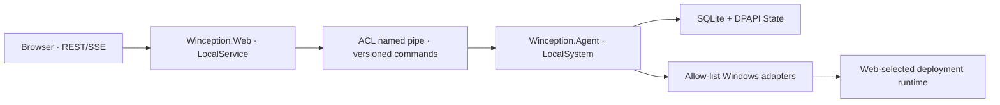

# 架構與安全邊界

## 權限隔離

Web 只處理 authentication、React assets、read model 與 schema-valid API，不接受任意 command line、PowerShell 或 filesystem path。Agent 只執行版本化 allow-list command。named pipe DACL 與 service SID 限制通訊者。

## OperationCoordinator

Mutation 先宣告 `config`、`deployment-ingress`、`runtime`、`os-cache`、`profile-payload`、`software-test-vm`、`evidence` 等 resources，以固定順序取得 locks。衝突回傳 `409 OPERATION_CONFLICT`。Read-only state、logs 與 evidence 查詢不取得 mutation lock。

## 資料

SQLite 保存設定、profiles、operations、migration 與 evidence index；WIM、ISO、log、JSONL 留在 filesystem並保存 hash、size、path、retention metadata。Secrets 使用 LocalMachine DPAPI 與 ACL，只有在發布 payload 的最短時間解密。
