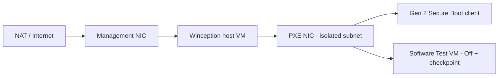

# VM 與網路拓撲

## 外層部署主機 VM

- Windows 11 Pro／Enterprise x64，Generation 2。
- 啟用 Nested Virtualization。
- 管理 NIC 連到 NAT 或可上網網路。
- PXE NIC 連到 isolated／private switch；不得有其他 DHCP responder。
- 管理與 PXE subnet 不可重疊。

在外層 Hyper-V 主機用 elevated PowerShell確認 VM 名稱、generation、NIC 與 switch。若沒有權限，停止並取得正確名稱；不要猜測。

```powershell
Get-VM -Name '<deployment-host-vm>' | Select-Object Name, Generation, State
Get-VMProcessor -VMName '<deployment-host-vm>' | Select-Object ExposeVirtualizationExtensions
Get-VMNetworkAdapter -VMName '<deployment-host-vm>' | Select-Object Name, SwitchName, MacAddress
Get-VMSwitch | Select-Object Name, SwitchType
```

## Nested client

Client 使用 Generation 2、至少固定 4 GB RAM、Microsoft Windows Secure Boot template，啟動前必須是 Off。Software Test VM 另需 clean checkpoint。



## DHCP 門檻

啟動 Winception DHCP 前，必須在測試窗口確認 isolated switch 沒有其他 responder。安裝與 Prepare runtime 不會自動啟動 DHCP。
