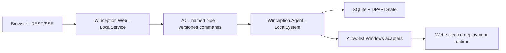

# Architecture and Security Boundaries

## Privilege isolation

Web handles authentication, React assets, the read model and schema-valid API calls. It does not accept arbitrary command lines, PowerShell or filesystem paths. The Agent executes versioned allow-listed commands only. A named-pipe DACL and service SID constrain callers.

## OperationCoordinator

A mutation declares resources such as `config`, `deployment-ingress`, `runtime`, `os-cache`, `profile-payload`, `software-test-vm` and `evidence`, then acquires locks in a fixed order. A conflict returns `409 OPERATION_CONFLICT`. Read-only state, log and evidence queries do not take mutation locks.

## Data

SQLite stores settings, profiles, operations, migrations and the evidence index. WIM, ISO, log and JSONL files stay on the filesystem with hash, size, path and retention metadata. Secrets use LocalMachine DPAPI and ACLs and are decrypted only for the shortest payload-publication window.
