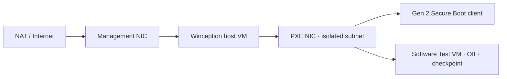

# VM and Network Topology

## Outer deployment-host VM

- Windows 11 Pro or Enterprise x64, Generation 2.
- Nested virtualization enabled.
- Management NIC on NAT or an Internet-capable network.
- PXE NIC on an isolated or private switch with no other DHCP responder.
- Management and PXE subnets must not overlap.

Use elevated PowerShell on the outer Hyper-V host to confirm the VM name, generation, NICs and switches. If permissions are unavailable, stop and obtain the real names; do not guess.

```powershell
Get-VM -Name '<deployment-host-vm>' | Select-Object Name, Generation, State
Get-VMProcessor -VMName '<deployment-host-vm>' | Select-Object ExposeVirtualizationExtensions
Get-VMNetworkAdapter -VMName '<deployment-host-vm>' | Select-Object Name, SwitchName, MacAddress
Get-VMSwitch | Select-Object Name, SwitchType
```

## Outer-host power gate

The outer Hyper-V host must not sleep or enter Modern Standby during a nested deployment test. Timers inside the Winception host VM pause safely while the VM is suspended, but a guest cannot keep its outer host awake; that run is not uninterrupted acceptance evidence.

Record the outer host's current AC sleep timeout before testing and temporarily set sleep to **Never** for the test window. Restore the original value afterward. Winception does not change the outer host power plan.

```powershell
powercfg /query SCHEME_CURRENT SUB_SLEEP STANDBYIDLE
```

## Nested client

Use a Generation 2 client with at least 4 GB fixed RAM and the Microsoft Windows Secure Boot template. It must be Off before testing. A Software Test VM also requires a clean checkpoint.



## DHCP gate

Before starting Winception DHCP, confirm that the isolated switch has no other responder during the test window. Installation and Prepare runtime never start DHCP automatically.
