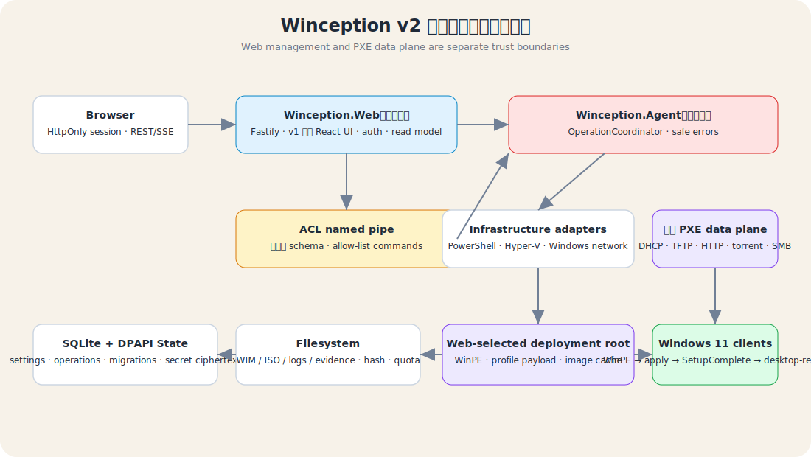

# 技術流程圖 / Technical Flow

[English SVG](../manual-assets/system-architecture.en.svg)

Canonical labels live in `flow-source.json`; SVG files are generated by `npm run v2:diagrams:write` and verified by CI. Do not edit generated SVG directly.

v2 將管理面與高權限執行面分離：browser 連到低權限 `Winception.Web`，Web 只用版本化 schema 經 ACL named pipe 呼叫 allow-list `Winception.Agent`。Agent 編排 SQLite/DPAPI/filesystem 與 Windows/PowerShell/Hyper-V/network adapters；PXE HTTP/TFTP/DHCP 資料面獨立服務 client。

Mutation 先取得 resource-aware operation lock，衝突回 `409 OPERATION_CONFLICT`；read-only state/log/evidence 不取得 mutation lock。REST snapshot 是 SSE 斷線後的恢復真相。大型 WIM/ISO/log 留在 filesystem，SQLite 只保存結構化資料、hash、size、path 與 retention metadata。
