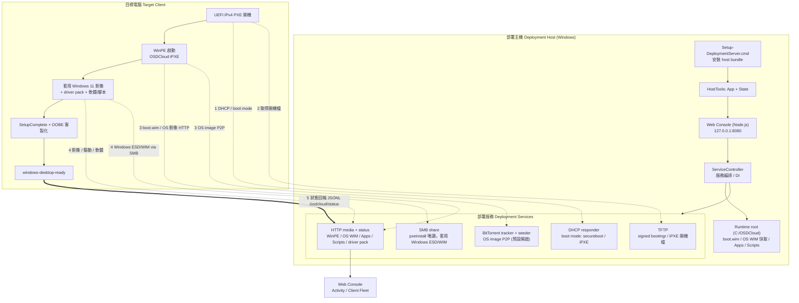

# 技術流程圖 (Technical Flow)

OSDCloud + iPXE 零接觸部署的系統架構與資料流。從部署主機安裝、服務編排，到目標電腦
PXE 開機、套用影像、回報狀態的完整路徑。

## 說明

| 元件 | 角色 |
| --- | --- |
| `Setup-DeploymentServer.cmd` | 安裝 host management bundle 到 `C:\OSDCloud\HostTools\App` 與 `…\State`，並啟動 Web console。 |
| Web Console (Node.js) | 管理 UI 與 API；唯讀檢視 + 明確授權的變更動作。 |
| `ServiceController` | 編排 DHCP / TFTP / HTTP(media) / Torrent，並管理 runtime 狀態。 |
| Runtime root | Web 選定的部署根目錄（預設 `C:\OSDCloud`），存放 `boot.wim`、OS WIM 快取、Apps、Scripts。 |
| Boot mode | 預設 `secureboot`（微軟簽章 Windows Boot Manager 走 TFTP）；`iPXE` 為替代路徑。 |
| 狀態回報 | client 以 JSONL POST 到 `/osdcloud/status`；生命週期：`run-start → winpe-end → windows-start → windows-apps-finished → windows-setupcomplete-finished → windows-desktop-ready`。 |

> 安全閘門：`Run preflight` 必須全綠、且確認測試 LAN 無其他 DHCP，才可 `Start services`。
