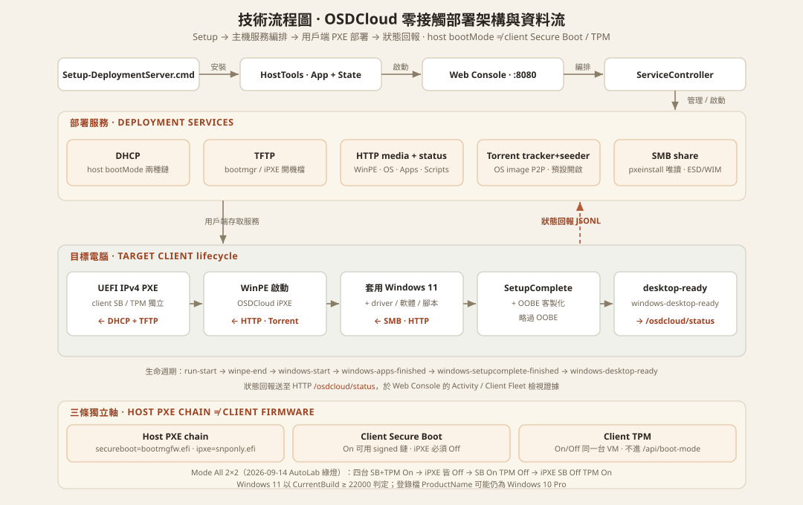

# 技術流程圖 (Technical Flow)

Winception Windows 11 zero-touch deployment 的系統架構與資料流。從部署主機安裝、
服務編排，到目標電腦 PXE 開機、套用映像、回報狀態的完整路徑。

## 說明

| 元件 | 角色 |
| --- | --- |
| `Setup-DeploymentServer.cmd` | 安裝 host management bundle 到 `C:\OSDCloud\HostTools\App` 與 `…\State`，並啟動 Web console。 |
| Web Console (Node.js) | 管理 UI 與 API；唯讀檢視 + 明確授權的變更動作。 |
| `ServiceController` | 編排 DHCP / TFTP / HTTP(media) / Torrent，並管理 runtime 狀態。 |
| Runtime root | Web 選定的部署根目錄（預設 `C:\OSDCloud`），存放 `boot.wim`、OS WIM 快取、Apps、Scripts。 |
| Offline ISO export | `Deploy` 的 `Offline ISO` 卡片會在主機端呼叫 `New-WinceptionUsbInstaller.ps1 -Iso`，把 immutable snapshot 寫到 `<deployment-root>\Exports`，並回報主機路徑。 |
| Boot mode | 主機 PXE 鏈，只有兩種：`secureboot`（`bootmgfw.efi` / TFTP）或 `ipxe`（`snponly.efi` / HTTP wimboot）。不要把 client Secure Boot 或 TPM 寫進 `/api/boot-mode`。 |
| Client firmware | Secure Boot On/Off 與 TPM On/Off 是目標電腦韌體，彼此獨立。iPXE 必須 Secure Boot Off。同一台 Gen2 VM 可切 TPM，不必另開 VM。 |
| Windows 11 | Guest 驗收看 `CurrentBuild` ≥ 22000 / `windowsFamily=Windows 11`。登錄檔 `ProductName` 在 25H2 上仍可能是 `Windows 10 Pro`。 |
| 狀態回報 | client 以 JSONL POST 到 `/osdcloud/status`；生命週期：`run-start → winpe-end → windows-start → windows-apps-finished → windows-setupcomplete-finished → windows-desktop-ready`。 |

> 安全閘門：`Run preflight` 必須全綠，且部署網段的 DHCP mode 已確認正確，才可 `Start services`。
>
> AutoLab `Mode All` 是 2×2 韌體矩陣（四台 SB+TPM On、iPXE 皆 Off、再兩個 corner），2026-09-14 已綠燈。這不能當成實體筆電或生產 DHCP 證據。
