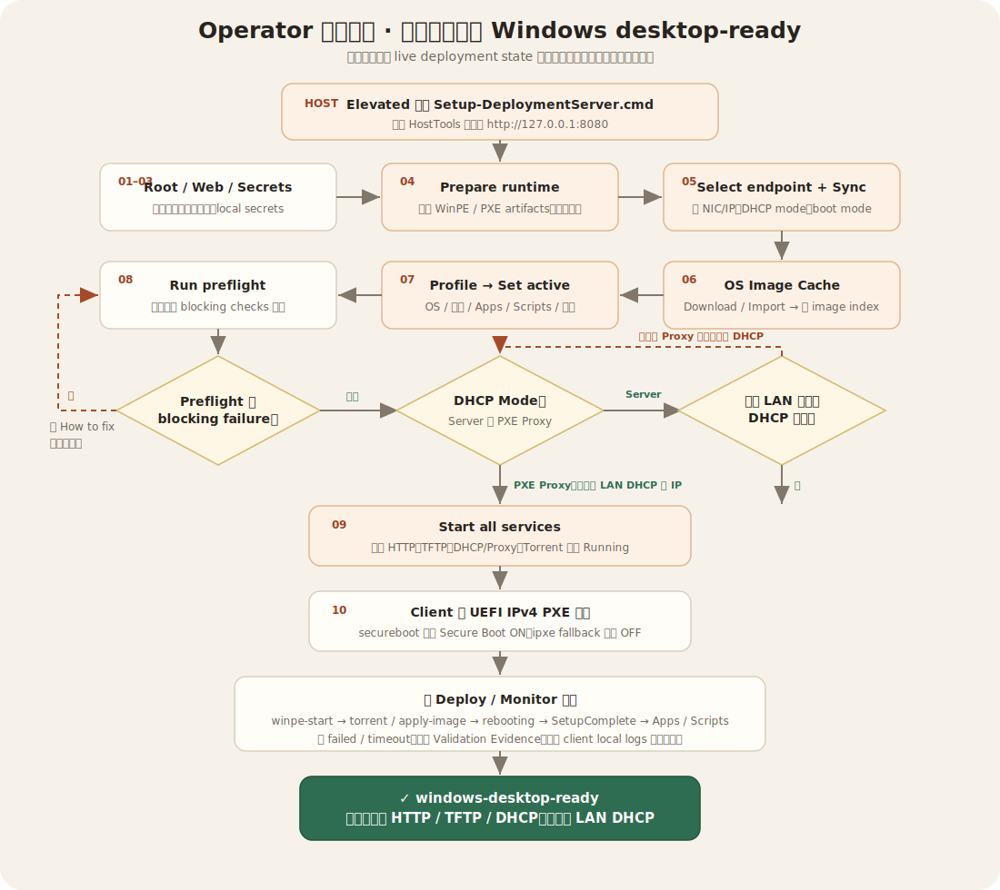

# 操作流程圖 / Operator Flow

[English SVG](../manual-assets/operator-flow.en.svg)

Canonical labels live in `flow-source.json`; SVG files are generated by `npm run v2:diagrams:write` and verified by CI. Do not edit generated SVG directly.

安全閘門是「是否存在 blocking failure」，不是要求畫面全綠。非阻擋 warning 應被檢視與記錄，但不會禁止服務啟動。開始 deployment ingress 前仍必須確認 DHCP Server／PXE Proxy 模式與實際 LAN 安排一致。

Software Test 是隔離旁支：同一把 operation lock 內再次確認 ingress stopped 與 Fleet empty，且不修改 live profile、Apps、runtime 或 PXE。正常 deployment 在 **Deploy / Monitor** 追蹤到 `windows-desktop-ready`。
