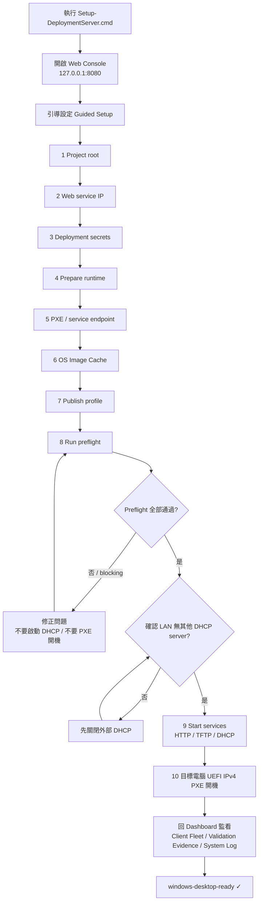

# 用戶流程圖 (User Flow)

操作者（operator）在 Web console 上從零到 `windows-desktop-ready` 的完整操作路徑，
含兩道安全閘門：preflight 必須全綠、確認 LAN 無其他 DHCP 才啟動服務。

## 說明

- **Guided Setup** 會依序顯示每一步的「用途、完成條件、安全提醒」。前 7 步準備環境，第 8 步把關，第 9–10 步才真正啟動部署。
- **第一道閘門（步驟 8）**：`Run preflight` 只要有 blocking failure，就不要啟動 DHCP，也不要讓 client PXE 開機 —— 回頭修正後重跑。
- **第二道閘門（步驟 9 前）**：必須先確認測試 LAN 沒有其他 DHCP server，才按 `Start services` / `Start all services`。
- 目標電腦從 `UEFI IPv4 PXE` 開機，不使用 USB/ISO、不手動點 OOBE；最終狀態應到 `windows-desktop-ready`。
- 詳細的子系統架構與資料流見 [technical-flow.md](technical-flow.md)。
